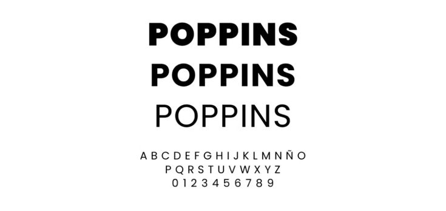
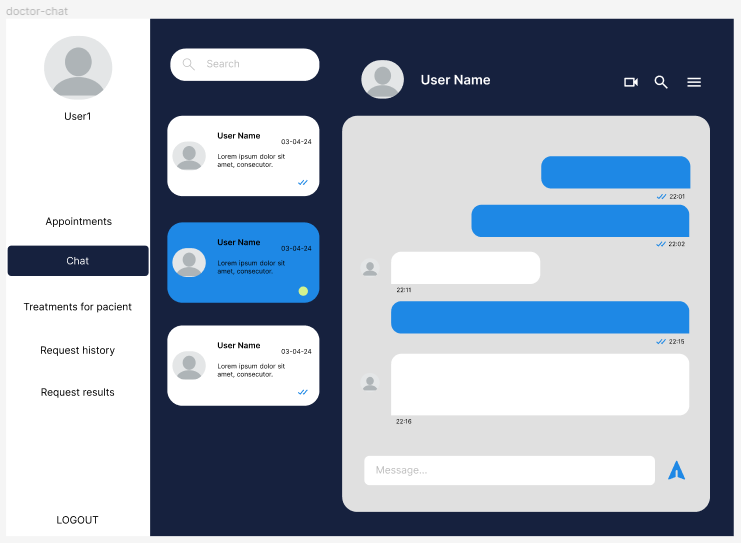
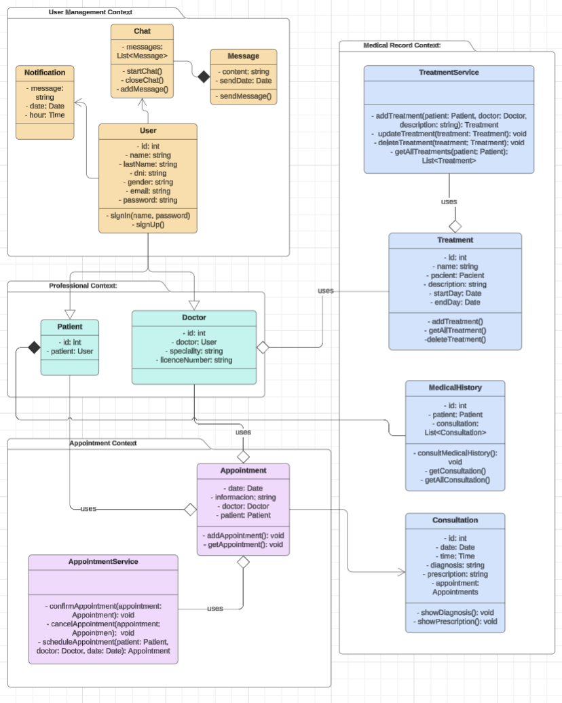

  <h1> Informe del Trabajo Final </h1>
  <h3> Universidad Peruana de Ciencias Aplicadas </h3>

  <h5> Ingeniería de Software </h5>

  <h5> Diseño de Experimentos de Ingeniería de Software </h5>

  <h5> Docente: Ivan Robles Fernández </h5>

  <h5> Startup: SuperMedStartUp </h5>

  <h5> Producto: Med </h5>

    <h3>Team Members:</h3>

     <table align="center">
        <tr>
            <th style="text-align:center;">Member</th>
            <th style="text-align:center;">Code</th>
        </tr>
        <tr>
            <td>Boronda Heidinger, Astrid Jimena</td>
            <td>U202215823</td>
        </tr>
        <tr>
            <td>Ventura Chancafe, Eduardo Renato </td>
            <td></td>
        </tr>
        <tr>
            <td>Palma Obispo, Adrián Enrique Jesús</td>
            <td></td>
        </tr>
        <tr>
            <td>Montes Figueroa. Juan Eduardo</td>
            <td>U202210775</td>
        </tr>
        <tr>
            <td>Palomino Santa Cruz, Erick Joaquin</td>
            <td>U202214843</td>
        </tr>
    </table>

<h5> Ciclo 2025-01 </h5>

## Registro de versiones del informe

|**Versión**|**Fecha**|**Autor**|**Descripción de modificación**|
| :-: | :-: | :-: | :-: |
|     |     |     |     |

## Project Report Collaboration Insights

## Contenido
1. [**Capítulo I: Introducción.**](#1.)  
1.1. [Startup Profile.](#1.1.)  
1.1.1. [Descripción del startup.](#1.1.1.)  
1.1.2. [Perfiles de los integrantes del equipo.](#1.1.2.)  
1.2. [Solution Profile.](#1.2.)  
1.2.1. [Antecedentes y Problemática.](#1.2.1.)  
1.2.2. [Lean UX Process.](#1.2.2.)  
1.2.2.1. [Lean UX Problem Statements.](#1.2.2.1.)  
1.2.2.2. [Lean UX Assumptions.](#1.2.2.2.)  
1.2.2.3. [Lean UX Hypothesis Statements.](#1.2.2.3.)  
1.2.2.4. [Lean UX Canvas.](#1.2.2.4.)  
1.3. [Segmentos objetivo.](#1.3.)  

2. [**Capítulo II: Requirements Elicitation & Analysis.**](#2.)  
2.1. [Competidores.](#2.1.)  
2.1.1. [Análisis competitivo.](#2.1.1.)  
2.1.2. [Estrategias y tácticas frente a competidores.](#2.1.2.)  
2.2. [Entrevistas.](#2.2.)  
2.2.1. [Diseño de entrevistas.](#2.2.1.)  
2.2.2. [Registro de entrevistas.](#2.2.2.)  
2.2.3. [Análisis de entrevistas.](#2.2.3.)  
2.3. [Needfinding.](#2.3.)  
2.3.1. [User Personas.](#2.3.1.)  
2.3.2. [User Task Matrix.](#2.3.2.)  
2.3.3. [User Journey Mapping.](#2.3.3.)  
2.3.4. [Empathy Mapping.](#2.3.4.)  
2.3.5. [As-is Scenario Mapping.](#2.3.5.)  
2.4. [Ubiquitous Language.](#2.4.)  

3. [**Capítulo III: Requirements Specification.**](#3.)  
3.1. [To-Be Scenario Mapping.](#3.1.)  
3.2. [User Stories.](#3.2.)  
3.3. [Impact Mapping.](#3.3.)  
3.4. [Product Backlog.](#3.4.)  

4. [**Capítulo IV: Product Design.**](#4.)  
4.1. [Style Guidelines.](#4.1.)  
4.1.1. [General Style Guidelines.](#4.1.1.)  
4.1.2. [Web Style Guidelines.](#4.1.2.)  
4.1.3. [Mobile Style Guidelines.](#4.1.3.)  
4.1.3.1. [iOS Mobile Style Guidelines.](#4.1.3.1.)  
4.1.3.2. [Android Mobile Style Guidelines.](#4.1.3.2.)  
4.2. [Information Architecture.](#4.2.)  
4.2.1. [Organization Systems.](#4.2.1.)  
4.2.2. [Labeling Systems.](#4.2.2.)  
4.2.3. [SEO Tags and Meta Tags](#4.2.3.)  
4.2.4. [Searching Systems.](#4.2.4.)  
4.2.5. [Navigation Systems.](#4.2.5.)  
4.3. [Landing Page UI Design.](#4.3.)  
4.3.1. [Landing Page Wireframe.](#4.3.1.)  
4.3.2. [Landing Page Mock-up.](#4.3.2.)  
4.4. [Web Applications UX/UI Design.](#4.4.)  
4.4.1. [Web Applications Wireframes.](#4.4.1.)  
4.4.2. [Web Applications Wireflow Diagrams.](#4.4.2.)  
4.4.3. [Web Applications Mock-ups.](#4.4.3.)  
4.4.4. [Web Applications User Flow Diagrams.](#4.4.4.)  
4.5. [Web Applications Prototyping.](#4.5.)  
4.6. [Domain-Driven Software Architecture.](#4.6.)  
4.6.1. [Software Architecture Context Diagram.](#4.6.1.)  
4.6.2. [Software Architecture Container Diagrams.](#4.6.2.)  
4.6.3. [Software Architecture Components Diagrams.](#4.6.3.)  
4.7. [Software Object-Oriented Design.](#4.7.)  
4.7.1. [Class Diagrams.](#4.7.1.)  
4.7.2. [Class Dictionary.](#4.7.2.)  
4.8. [Database Design.](#4.8.)  
4.8.1. [Database Diagram.](#4.8.1.)  

5. [**Capítulo V: Product Implementation, Validation & Deployment.**](#5.)  
5.1. [Software Configuration Management.](#5.1.)  
5.1.1. [Software Development Environment Configuration.](#5.1.1.)  
5.1.2. [Source Code Management.](#5.1.2.)  
5.1.3. [Source Code Style Guide & Conventions.](#5.1.3.)  
5.1.4. [Software Deployment Configuration.](#5.1.4.)  
5.2. [Landing Page, Services & Applications Implementation.](#5.2.)  
5.2.1. [Sprint 1.](#5.2.1.)  
5.2.1.1. [Sprint Planning 1.](#5.2.1.1.)  
5.2.1.2. [Sprint Backlog 1.](#5.2.1.2.)  
5.2.1.3. [Development Evidence for Sprint Review.](#5.2.1.3.)  
5.2.1.4. [Testing Suite Evidence for Sprint Review.](#5.2.1.4.)  
5.2.1.5. [Execution Evidence for Sprint Review.](#5.2.1.5.)  
5.2.1.6. [Services Documentation Evidence for Sprint Review.](#5.2.1.6.)  
5.2.1.7. [Software Deployment Evidence for Sprint Review.](#5.2.1.7.)  
5.2.1.8. [Team Collaboration Insights during Sprint.](#5.2.1.8.)  
5.2.2. [Sprint 2.](#5.2.2.)  
5.2.2.1. [Sprint Planning 2.](#5.2.2.1.)  
5.2.2.2. [Sprint Backlog 2.](#5.2.2.2.)  
5.2.2.3. [Development Evidence for Sprint Review.](#5.2.2.3.)  
5.2.2.4. [Testing Suite Evidence for Sprint Review.](#5.2.2.4.)  
5.2.2.5. [Execution Evidence for Sprint Review.](#5.2.2.5.)  
5.2.2.6. [Services Documentation Evidence for Sprint Review.](#5.2.2.6.)  
5.2.2.7. [Software Deployment Evidence for Sprint Review.](#5.2.2.7.)  
5.2.2.8. [Team Collaboration Insights during Sprint.](#5.2.2.8.)  
5.2.3. [Sprint 3.](#5.2.3.)  
5.2.3.1. [Sprint Planning 3.](#5.2.3.1.)  
5.2.3.2. [Sprint Backlog 3.](#5.2.3.2.)  
5.2.3.3. [Development Evidence for Sprint Review.](#5.2.3.3.)  
5.2.3.4. [Testing Suite Evidence for Sprint Review.](#5.2.3.4.)  
5.2.3.5. [Execution Evidence for Sprint Review.](#5.2.3.5.)  
5.2.3.6. [Services Documentation Evidence for Sprint Review.](#5.2.3.6.)  
5.2.3.7. [Software Deployment Evidence for Sprint Review.](#5.2.3.7.)  
5.2.3.8. [Team Collaboration Insights during Sprint.](#5.2.3.8.)  
5.2.4. [Sprint 4.](#5.2.4.)  
5.2.4.1. [Sprint Planning 4.](#5.2.4.1.)  
5.2.4.2. [Sprint Backlog 4.](#5.2.4.2.)  
5.2.4.3. [Development Evidence for Sprint Review.](#5.2.4.3.)  
5.2.4.4. [Testing Suite Evidence for Sprint Review.](#5.2.4.4.)  
5.2.4.5. [Execution Evidence for Sprint Review.](#5.2.4.5.)  
5.2.4.6. [Services Documentation Evidence for Sprint Review.](#5.2.4.6.)  
5.2.4.7. [Software Deployment Evidence for Sprint Review.](#5.2.4.7.)  
5.2.4.8. [Team Collaboration Insights during Sprint.](#5.2.4.8.)  
5.3. [Validation Interviews.](#5.3.)  
5.3.1. [Diseño de Entrevistas.](#5.3.1.)  
5.3.2. [Registro de Entrevistas.](#5.3.2.)  
5.3.3. [Evaluaciones según heurísticas.](#5.3.3.)  
5.4. [Video About-the-Product.](#5.4.)  

6. [**Capítulo VI: Product Verification & Validation.**](#6.)  
6.1. [Testing Suites & Validation](#6.1.)  
6.1.1. [Core Entities Unit Tests.](#6.1.1.)  
6.1.2. [Core Integration Tests.](#6.1.2.)  
6.1.3. [Core Behavior-Driven Development](#6.1.3.)  
6.1.4. [Core System Tests.](#6.1.4.)  
6.2. [Static testing & Verification](#6.2.)  
6.2.1. [Static Code Analysis](#6.2.1.)  
6.2.1.1. [Coding standard & Code conventions.](#6.2.1.1.)  
6.2.1.2. [Code Quality & Code Security.](#6.2.1.2.)  
6.2.2. [Reviews](#6.2.2.)  
6.3. [Validation Interviews.](#6.3.)  
6.3.1. [Diseño de Entrevistas.](#6.3.1.)  
6.3.2. [Registro de Entrevistas.](#6.3.2.)  
6.3.3. [Evaluaciones según heurísticas.](#6.3.3.)  
6.4. [Auditoría de Experiencias de Usuario](#6.4.)  
6.4.1. [Auditoría realizada.](#6.4.1.)  
6.4.1.1. [Información del grupo auditado.](#6.4.1.1.)  
6.4.1.2. [Cronograma de auditoría realizada.](#6.4.1.2.)  
6.4.1.3. [Contenido de auditoría realizada.](#6.4.1.3.)  
6.4.2. [Auditoría recibida.](#6.4.2.)  
6.4.2.1. [Información del grupo auditor.](#6.4.2.1.)  
6.4.2.2. [Cronograma de auditoría recibida.](#6.4.2.2.)  
6.4.2.3. [Contenido de auditoría recibida.](#6.4.2.3.)  
6.4.2.4. [Resumen de modificaciones para subsanar hallazgos.](#6.4.2.4.)  

7. [**Capítulo VII: DevOps Practices**](#7.)  
7.1. [Continuous Integration](#7.1.)  
7.1.1. [Tools and Practices.](#7.1.1.)  
7.1.2. [Build & Test Suite Pipeline Components.](#7.1.2.)  
7.2. [Continuous Delivery](#7.2.)  
7.2.1. [Tools and Practices.](#7.2.1.)  
7.2.2. [Stages Deployment Pipeline Components.](#7.2.2.)  
7.3. [Continuous deployment](#7.3.)  
7.3.1. [Tools and Practices.](#7.3.1.)  
7.3.2. [Production Deployment Pipeline Components.](#7.3.2.)  
7.4. [Continuous Monitoring](#7.4.)  
7.4.1. [Tools and Practices](#7.4.1.)  
7.4.2. [Monitoring Pipeline Components](#7.4.2.)  
7.4.3. [Alerting Pipeline Components](#7.4.3.)  
7.4.4. [Notification Pipeline Components.](#7.4.4.)  

8. [**Capítulo VIII: Experiment-Driven Development**](#8.)  
8.1. [Experiment Planning](#8.1.)  
8.1.1. [As-Is Summary.](#8.1.1.)  
8.1.2. [Raw Material: Assumptions, Knowledge Gaps, Ideas, Claims.](#8.1.2.)  
8.1.3. [Experiment-Ready Questions.](#8.1.3.)  
8.1.4. [Question Backlog.](#8.1.4.)  
8.1.5. [Experiment Cards.](#8.1.5.)  
8.2. [Experiment Design](#8.2.)  
8.2.1. [Hypotheses.](#8.2.1.)  
8.2.2. [Measures.](#8.2.2.)  
8.2.3. [Conditions.](#8.2.3.)  
8.2.4. [Scale Calculations and Decisions.](#8.2.4.)  
8.2.5. [Methods Selection.](#8.2.5.)  
8.2.6. [Data Analytics: Goals, KPIs and Metrics Selection.](#8.2.6.)  
8.2.7. [Web and Mobile Tracking Plan.](#8.2.7.)  
8.3. [Experimentation](#8.3.)  
8.3.1. [To-Be User Stories.](#8.3.1.)  
8.3.2. [To-Be Product Backlog](#8.3.2.)  
8.3.3. [Pipeline-supported, Experiment-Driven To-Be Software Platform Lifecycle](#8.3.3.)  
8.3.3.1. [To-Be Sprint Backlogs](#8.3.3.1.)  
8.3.3.2. [Implemented To-Be Landing Page Evidence](#8.3.3.2.)  
8.3.3.3. [Implemented To-Be Frontend-Web Application Evidence](#8.3.3.3.)  
8.3.3.4. [Implemented To-Be Native-Mobile Application Evidence](#8.3.3.4.)  
8.3.3.5. [Implemented To-Be RESTful API and/or Serverless Backend Evidence](#8.3.3.5.)  
8.3.3.6. [Team Collaboration Insights](#8.3.3.6.)  
8.3.4. [To-Be Validation Interviews](#8.3.4.)  
8.3.4.1. [Diseño de Entrevistas.](#8.3.4.1.)  
8.3.4.2. [Registro de Entrevistas.](#8.3.4.2.)  
8.4. [Experiment Aftermath & Analysis](#8.4.)  
8.4.1. [Analysis and Interpretation of Results](#8.4.1.)  
8.4.2. [Re-scored and Re-prioritized Question Backlog](#8.4.2.)  
8.5. [Continuous Learning](#8.5.)  
8.5.1. [Shareback Session Artifacts: Learning Workflow](#8.5.1.)  
8.6. [To-Be Software Platform Pre-launch](#8.6.)  
8.6.1. [About-the-Product Intro Video](#8.6.1.)  

## Student Outcome

|**Criterio específico**|**Acciones realizadas**|**Conclusiones**|
| :-: | :-: | :-: |
|     |     |     |

## 1.2 Solution Profile

### 1.2.1. Antecedentes y problemática

Muchos pacientes necesitan atención que requiere una toma de decisiones conjunta entre múltiples actores y/o servicios. La evaluación de interconsultas es tediosa e ineficaz debido a la estructura actual de atención en la mayoría de los consultorios y clínicas. Los pacientes con diabetes de pie que están hospitalizados en los pabellones de medicina son un ejemplo típico en el que la demora en los procedimientos o intervenciones quirúrgicas realizadas por los servicios de traumatología puede resultar en complicaciones graves e incluso en la muerte del paciente.

La Encuesta Nacional de Hogares (ENAHO) de 2022 revela que 7 de cada 10 personas que necesitaron atención médica no la obtuvieron . El 35 % de ellos mencionó demoras como la razón principal, mientras que razones como distancia y falta de seguro solo fueron citadas por el 13 % y el 3 %, respectivamente.

La situación actual enfatiza la importancia de una solución tecnológica que facilite la comunicación entre pacientes y especialistas, optimice el seguimiento de tratamientos, centralice el almacenamiento de historias clínicas y simplifique la gestión de citas. Además, se vuelve necesario incorporar consultas virtuales y recordatorios automáticos de citas para mejorar la accesibilidad y la eficiencia de la atención médica en el campo de la traumatología.

Se aplica la técnica 5W-2H que permite analizar las necesidades de nuestros usuarios al realizar una reflexión de las características principales de la situación general. Presentamos la información obtenida de las respuestas a las preguntas planteadas en la técnica.

- **What(¿Qué?)**

  El problema radica en la falta de un sistema integral y automatizado en el área de traumatología, lo que resulta en largos tiempos de espera para programar consultas, cirugías y exámenes. Esto afecta la experiencia del paciente y puede obstaculizar su recuperación.

- **When(¿Cuándo?)**

  El problema se manifiesta en el momento en que los pacientes requieren atención médica traumatológica, especialmente en situaciones que demandan decisiones rápidas y coordinadas entre múltiples actores. Las demoras pueden ocurrir en cualquier momento del proceso de atención, desde la consulta inicial hasta la realización de procedimientos o intervenciones quirúrgicas.

- **Where(¿Dónde?)**

  Los problemas se observan en la atención médica traumatológica, tanto en consultorios como en clínicas. Específicamente, se destacan situaciones como la evaluación de interconsultas y la gestión de citas, donde la estructura actual de atención presenta deficiencias.

- **Who(¿Quién?)**

  El problema afecta tanto a pacientes como a especialistas en traumatología, así como a otros actores involucrados en el proceso de atención médica, como personal administrativo y de apoyo.

- **Why(¿Por qué?)**

  El problema surge debido a la falta de comunicación eficiente entre los diferentes actores involucrados, la falta de centralización en el almacenamiento de historias clínicas, la complejidad en la gestión de citas y la falta de acceso a la atención médica oportuna.

- **How(¿Cómo?)**

  El problema se diferencia del estado óptimo por la presencia de demoras en la atención, complicaciones graves para los pacientes y una falta de accesibilidad generalizada. La tendencia indica una necesidad creciente de soluciones tecnológicas que mejoren la comunicación, la gestión de datos y la accesibilidad en la atención traumatológica.

- **How much(¿Cuánto?)**

  La Encuesta Nacional de Hogares (ENAHO) de 2022 revela que 7 de cada 10 personas que necesitaron atención médica no la obtuvieron, lo que indica que una gran cantidad de personas son afectadas por problemas de acceso y gestión en el área de salud. Los costos asociados pueden ser significativos, tanto en términos de salud pública como en la calidad de vida de los pacientes y la eficiencia de los servicios médicos.

### 1.2.2. Lean UX Process

### 1.2.2.1. Lean UX Problem Statements

El estado actual de la atención médica en el campo de la traumatología se ha centrado principalmente en la prestación de servicios tradicionales, lo que ha resultado en demoras significativas en los procedimientos, interconsultas ineficaces y una falta de accesibilidad para muchos pacientes. Lo que los productos/servicios existentes no logran abordar es la integración efectiva de tecnología para facilitar la comunicación entre doctores y pacientes, optimizar el seguimiento de tratamientos, centralizar el almacenamiento de historias clínicas y simplificar la gestión de citas.

Nuestro producto, MedSystem, abordará esta brecha mediante el desarrollo de una solución web innovadora que aprovecha tecnologías modernas. Nos enfocaremos en proporcionar una plataforma que permita a los pacientes sacar citas en línea, acceder fácilmente a su historial médico, realizar consultas virtuales y recibir recordatorios automáticos de citas. Además, facilitaremos la comunicación fluida entre doctores y pacientes, así como entre doctores, para mejorar la coordinación del cuidado.

Nuestro enfoque inicial será dirigirnos tanto a doctores especialistas en traumatología como a pacientes con necesidades específicas de atención médica traumatológica, como aquellos con lesiones deportivas, fracturas o condiciones crónicas relacionadas. Sabremos que tenemos éxito cuando veamos una disminución significativa en las demoras en los procedimientos, un aumento en la satisfacción del paciente, una mayor eficiencia en la coordinación del cuidado y una mejora en la accesibilidad general a la atención médica en el campo de la traumatología.

### 1.2.2.2. Lean UX Assumptions

- **Business outcomes:**

  1. El usuario necesita optimizar la gestión de citas y procesos en el área de traumatología de manera eficiente.
  2. Las necesidades del usuario se resolverán a través de una aplicación web integrada en línea que permite programar citas, cirugías, exámenes y seguimiento de tratamientos.
  3. Los usuarios son pacientes que buscan atención en el área de traumatología y profesionales médicos especializados en el tratamiento.
  4. El usuario desea una interfaz fácil de usar para reservar citas, acceder a los registros médicos y comunicarse con los proveedores de atención médica.
  5. A través de nuestro servicio, los usuarios también pueden obtener consultas virtuales, recordatorios automáticos de citas y análisis de datos para mejorar los procesos.
  6. Ganaré dinero cobrando a los proveedores de atención médica tarifas de suscripción por el uso de la plataforma y posiblemente ofreciendo características premium por un cargo adicional.
  7. Mi competencia principal es el software de programación de citas independientes y los sistemas de gestión hospitalaria actuales.
  8. Con una solución más completa y específicamente diseñada para la atención traumatológica, que incluye características como consultas virtuales y recordatorios automáticos, venceremos a la competencia.
  9. Mi mayor riesgo es la resistencia de los proveedores de atención médica a adoptar nuevas tecnologías o integrarlas en sus sistemas existentes.
  10. Mediante la capacitación y el soporte extensivos al personal de atención médica durante el proceso de incorporación y la demostración de los claros beneficios del uso de la plataforma, reduciremos el riesgo.

- **User Assumptions:**

  - **¿Quién es el usuario?**

    Pacientes que necesitan atención traumatológica y médicos especializados en el área.

  - **¿Dónde encaja nuestro producto en su trabajo o vida?**

    El producto servirá como un lugar central para administrar citas traumatológicas, registros médicos y comunicación entre pacientes y proveedores de atención médica.

  - **¿Qué problema tiene nuestro producto? ¿Cómo se resuelve?**

    Reduce los tiempos de espera, facilita la programación de citas, centraliza los registros médicos para una toma de decisiones informada y permite consultas virtuales para mayor comodidad.

  - **¿Cuándo y cómo es usado nuestro producto?**

    Los usuarios pueden acceder a la plataforma desde una variedad de dispositivos, como computadoras de escritorio y teléfonos inteligentes, para reservar citas, revisar registros médicos y comunicarse con proveedores de atención médica desde casa, el trabajo o en movimiento.

  - **¿Qué características son importantes?**

    La programación de citas, el acceso a los registros médicos, las consultas virtuales y los recordatorios automáticos de citas mejoran la experiencia del paciente y el proceso de atención traumatológica.

  - **¿Cómo debe verse nuestro producto y comportarse?**

    El producto debe tener una interfaz limpia e intuitiva, ser fácil de navegar e integrarse perfectamente con los sistemas de atención médica actuales para los proveedores de atención médica. Además, debe ser fácil de usar y accesible para pacientes de todos los grupos demográficos.

- **User Benefits:**

  - **Acceso rápido y fácil a la atención médica en traumatología:** Los usuarios pueden obtener atención médica de forma rápida y sencilla, lo que les permite abordar sus necesidades de salud de manera oportuna.
  - **Gestión eficiente de citas y procesos médicos:** Los usuarios pueden gestionar sus citas y procesos médicos de manera eficiente, lo que reduce los tiempos de espera y mejora la organización en la clínica.
  - **Comunicación fluida entre pacientes y especialistas:** Los usuarios pueden comunicarse de manera fluida con los especialistas médicos, lo que facilita la discusión de problemas de salud y la obtención de orientación médica adecuada.
  - **Centralización de registros médicos para una toma de decisiones informada:** Los usuarios tienen acceso a sus registros médicos centralizados, lo que les permite tomar decisiones informadas sobre su salud y tratamiento en colaboración con los especialistas.

- **Business Assumptions:**

  - Existe demanda de un sistema de programación y gestión de citas simplificado en consultorios de traumatología.
  - Las instituciones médicas están dispuestas a adoptar nuevas tecnologías para mejorar sus procesos de programación de citas y gestión de pacientes.
  - Las consultas virtuales son efectivas para satisfacer las necesidades de pacientes y profesionales médicos en traumatología.
  - Las características y beneficios de la plataforma conducirán a una mayor eficiencia y una mayor satisfacción del paciente, lo que resultará en rentabilidad para el negocio.

- **Features:**
  - **Programación de citas en línea:** Permite a los usuarios reservar citas de manera conveniente a través de una interfaz fácil de usar.
  - **Consulta Virtual:** Permite a los usuarios tener consultas con especialistas médicos de forma remota mediante llamadas de video o audio.
  - **Historias clínicas centralizadas:** Proporciona a los usuarios acceso seguro a su historial médico, resultados de pruebas y planes de tratamiento.
  - **Recordatorios automatizados de citas:** Envía recordatorios automatizados a los usuarios por correo electrónico o SMS para notificarles sobre citas próximas.
  - **Canales de comunicación seguros:** Facilita la comunicación entre usuarios y profesionales médicos mientras se mantiene la seguridad de los datos y la confidencialidad del paciente.

### 1.2.2.3. Lean UX Hypothesis Statements

- Creemos que los tiempos de espera se reducirán significativamente si los pacientes puede programar citas de manera rápida y eficiente a través de una plataforma en línea
- Creemos que la comunicación entre especialistas mejorará si se implementa un sistema para compartir historias clínicas y procesos médicos de manera rápida y efectiva
- Creemos que la experiencia del paciente mejorará si se ofrecen consultas virtuales y recordatorios automáticos de citas

### 1.2.2.4. Lean UX Canvas

### 1.3. Segmentos objetivo

Nuestros segmentos objetivos en este se dividen en tres grupos fundamentales. Como primer segmento contamos con los pacientes que son los que han sufrido algún tipo de accidente y requieren una atención en el área de traumatología. En segundo lugar serían los médicos especialistas en el área de traumatología que requerirán de nuestro sistema para la gestión de sus citas y establecer una buena comunicación entre sus demás colegas de profesión, o laboratorios para una correcta coordinación de algún proceso que se lleve a cabo con el paciente. Por último están las consultorías o laboratorios quienes recibirán la información del paciente, brindada por los doctores, incluyendo procedimientos que requiera el paciente ya sea un tratamiento o algún tipo de examen.

---
 

# Capítulo III: Requirements Specification

## 3.1 To-Be Scenario Mapping
En esta sección se presenta el mapeo de los escenarios, realizando una tabla con la situación a mejorar del segmento objetivo, analizando que pasos se realizarán y cómo se siente.

<b>Para el segmento 1 (Pacientes):</b>

<b>Para el segmento 2 (Doctores):</b>

<b>Para el segmento 3 (Laboratorios):</b>

## 3.2 User Stories

| Epic / Story ID |                                        Título                                        |                                                                                                                                                                    Descripción                                                                                                                                                                    |                                                                                                                                                                                                                                                                                                                                                                                                              Criterios de Aceptación                                                                                                                                                                                                                                                                                                                                                                                                               | Relacionado con (Epic ID) |
|:---------------:|:------------------------------------------------------------------------------------:| :-----------------------------------------------------------------------------------------------------------------------------------------------------------------------------------------------------------------------------------------------------------------------------------------------------------------------------------------------: |:--------------------------------------------------------------------------------------------------------------------------------------------------------------------------------------------------------------------------------------------------------------------------------------------------------------------------------------------------------------------------------------------------------------------------------------------------------------------------------------------------------------------------------------------------------------------------------------------------------------------------------------------------------------------------------------------------------------------------------------------------------------------------------------------------------------------------------------------------:| :-----------------------: | 
|       E01       |                         Gestión de Inventario de Laboratorio                         |                                            Como técnico de laboratorio, deseo una plataforma tecnológica que me permita gestionar eficientemente el inventario de suministros y equipos, para garantizar la disponibilidad de materiales necesarios y optimizar el flujo de trabajo en el laboratorio.                                            |                                                                                                                                                                                                                                                                                                                                                                                                                         -                                                                                                                                                                                                                                                                                                                                                                                                                          |             -             |
|       E02       |                               Gestión de citas médicas                               |                                                               Como paciente, deseo tener acceso a una plataforma tecnológica que facilite la gestión de mis citas médicas, para poder organizar mi agenda de manera eficiente y recibir una atención médica oportuna y de calidad.                                                                |                                                                                                                                                                                                                                                                                                                                                                                                                         -                                                                                                                                                                                                                                                                                                                                                                                                                          |             -             |
|       E03       |                 Plataforma tecnológica para tratamientos ortopédicos                 |                                                            Como médico traumatológico, quiero tener una plataforma tecnológica que me permita gestionar eficientemente los tratamientos de mis pacientes, para poder proporcionar una atención médica de alta calidad y personalizada.                                                            |                                                                                                                                                                                                                                                                                                                                                                                                                         -                                                                                                                                                                                                                                                                                                                                                                                                                          |             -             |
|       E04       |                        Acceso a historial médico del paciente                        |                                                                                      Como médico traumatológico,deseo poder acceder al historial médico completo de mis pacientes, para tomar decisiones informadas y brindarles la mejor atención posible.                                                                                       |                                                                                                                                                                                                                                                                                                                                                                                                                         -                                                                                                                                                                                                                                                                                                                                                                                                                          |             -             |
|       E05       |                   Gestión de muestras y resultados de laboratorio                    |                                                                                                  Como técnico de laboratorio, deseo contar con una aplicación web que me permita optimizar la gestión de muestras y resultados de los pacientes.                                                                                                  |                                                                                                                                                                                                                                                                                                                                                                                                                         -                                                                                                                                                                                                                                                                                                                                                                                                                          |             -             |
|       E06       |                   Acceso a página informativa sobre la aplicación                    |                                                                                                                   Como paciente quiero poder entrar una landing page donde esté la información esencial sobre la aplicación web                                                                                                                   |                                                                                                                                                                                                                                                                                                                                                                                                                         -                                                                                                                                                                                                                                                                                                                                                                                                                          |             -             |
|      US01       |                                 Registro de Muestras                                 |                                              Como técnico de laboratorio, quiero poder registrar nuevas muestras en el sistema, incluyendo detalles como el código de la muestra, tipo de muestra y fecha de recepción, para mantener un seguimiento preciso de todas las muestras recibidas.                                              |                                                                                      
**Escenario 1: Registro Exitoso**

- Dado que el técnico de laboratorio está en la página de registro de muestras,

- Cuando el técnico ingresa una nueva muestra con todos los campos requeridos correctamente,

- Entonces el sistema registra la muestra y muestra un mensaje de confirmación.

**Escenario 2: Validación de Campos Obligatorios**

- Dado que el técnico de laboratorio está en la página de registro de muestras,

- Cuando el técnico intenta ingresar una nueva muestra sin completar todos los campos obligatorios,

- Entonces el sistema muestra un mensaje de error indicando los campos faltantes.
                                                                                      |            E01            |
|      US02       |                                Asignación de Análisis                                |                         Como técnico de laboratorio, quiero poder asignar análisis específicos a las muestras registradas, incluyendo detalles como el tipo de análisis y el técnico responsable, para asegurar que cada muestra sea analizada adecuadamente.                         |                                                                          
**Escenario 1: Asignación Exitosa**

- Dado que el técnico de laboratorio está en la página de asignación de análisis,

- Cuando el técnico asigna un análisis a una muestra con todos los campos requeridos correctamente,

- Entonces el sistema registra la asignación y muestra un mensaje de confirmación.

**Escenario 2: Validación de Campos Obligatorios**

- Dado que el técnico de laboratorio está en la página de asignación de análisis,

- Cuando el técnico intenta asignar un análisis a una muestra sin completar todos los campos obligatorios,

- Entonces el sistema muestra un mensaje de error indicando los campos faltantes.
                                                                           |            E01            |
|      US03       |                          Registro de Resultados de Análisis                          |                                                       Como técnico de laboratorio, quiero poder registrar los resultados de los análisis realizados en las muestras, incluyendo detalles como los valores obtenidos, la fecha del análisis y observaciones, para mantener un registro completo y preciso.                                                        |                                                          
**Escenario 1: Registro Exitoso**

- Dado que el técnico de laboratorio está en la página de registro de resultados de análisis,

- Cuando el técnico ingresa los resultados del análisis con todos los campos requeridos correctamente,

- Entonces el sistema registra los resultados y muestra un mensaje de confirmación.

**Escenario 2: Validación de Campos Obligatorios**

- Dado que el técnico de laboratorio está en la página de registro de resultados de análisis,

- Cuando el técnico intenta ingresar los resultados del análisis sin completar todos los campos obligatorios,

- Entonces el sistema muestra un mensaje de error indicando los campos faltantes.
                                                           |            E01            |
|      US04       |                                 Consulta de Muestras                                 |                                                Como técnico de laboratorio, quiero poder consultar las muestras registradas en el sistema mediante diversos criterios de búsqueda (por ejemplo, código de muestra, fecha de recepción), para localizar rápidamente la información necesaria.                                                 |                                                                                          
**Escenario 1: Consulta Exitosa**

- Dado que el técnico de laboratorio está en la página de consulta de muestras,

- Cuando el técnico ingresa los criterios de búsqueda y realiza la consulta,

- Entonces el sistema muestra una lista de muestras que coinciden con los criterios ingresados.

**Escenario 2: Sin Resultados**

- Dado que el técnico de laboratorio está en la página de consulta de muestras,

- Cuando el técnico ingresa los criterios de búsqueda y realiza la consulta,

- Entonces el sistema muestra un mensaje indicando que no se encontraron muestras que coincidan con los criterios.
                                                                                           |            E01            |
|      US05       |                          Generación de Reportes de Análisis                          |                                      Como técnico de laboratorio, quiero poder generar reportes de los análisis realizados, incluyendo detalles de las muestras, resultados y observaciones, para proporcionar información completa y detallada a los solicitantes de los análisis.                                       |                                                                                              
**Escenario 1: Generación Exitosa**

- Dado que el técnico de laboratorio está en la página de generación de reportes,

- Cuando el técnico selecciona los parámetros de reporte y solicita la generación,

- Entonces el sistema genera el reporte y lo presenta en un formato descargable.

**Escenario 2: Falta de Parámetros**

- Dado que el técnico de laboratorio está en la página de generación de reportes,

- Cuando el técnico intenta generar un reporte sin seleccionar todos los parámetros necesarios,

- Entonces el sistema muestra un mensaje de error indicando los parámetros faltantes.
                                                                                               |            E01            |
|      US06       |                   Adjuntar Archivo PDF con Resultados de Análisis                    |                                                              Como técnico de laboratorio, quiero poder adjuntar un archivo PDF con los resultados de los análisis realizados en las muestras, para proporcionar un informe detallado y estandarizado que pueda ser revisado y compartido fácilmente.                                                              | 
**Escenario 1: Adjuntar Archivo Exitoso**

- Dado que el técnico de laboratorio está en la página de registro de resultados de análisis,
- Cuando el técnico selecciona una muestra y adjunta un archivo PDF con los resultados del análisis,
 

- Entonces el sistema carga el archivo correctamente, lo asocia con la muestra correspondiente y muestra un mensaje de confirmación.

 
**Escenario 2: Tamaño de Archivo Excedido**

- Dado que el técnico de laboratorio está en la página de registro de resultados de análisis,

- Cuando el técnico intenta adjuntar un archivo PDF que excede el tamaño máximo permitido,

- Entonces el sistema muestra un mensaje de error indicando que el archivo es demasiado grande y no permite la carga hasta que se adjunte un archivo de tamaño aceptable. |            E01            |
|      US07       |                                Registro de Nueva Cita                                |                                                                                                 Como paciente, quiero programar una nueva cita médica a través de la plataforma en línea de MedSystem para evitar tener que llamar por teléfono.                                                                                                  |                                                       
**Escenario 1: Registro de Cita para Pacientes Registrados**

- Dado que el usuario es un paciente registrado en MedSystem,

- Cuando selecciona la opción de programar una nueva cita médica desde la plataforma,

- Entonces es redirigido a un formulario donde puede ingresar los detalles de la cita, como la fecha, hora y motivo de la consulta.

**Escenario 2: Registro de Cita para Nuevos Pacientes**

- Dado que el usuario es un nuevo paciente en MedSystem,

- Cuando accede a la plataforma por primera vez y elige programar una cita médica,

- Entonces se le solicita completar un formulario de registro con su información personal antes de poder programar la cita.
                                                        |            E02            |
|      US08       |                        Selección de Especialista y Ubicación                         |                                                                                      Como paciente, quiero poder seleccionar al especialista y la ubicación preferida para mi cita médica en MedSystem, para poder planificar de acuerdo a mis necesidades.                                                                                       |                     
**Escenario 1: Selección de Especialista Disponible**

- Dado que el usuario está programando una cita médica en MedSystem,

- Cuando elige la opción de seleccionar un especialista desde la plataforma,

- Entonces se le presenta una lista de especialistas disponibles junto con su especialidad y ubicación, lo que le permite elegir el más adecuado para su consulta.

**Escenario 2: Selección de Ubicación para la Cita Médica**

- Dado que el usuario tiene una preferencia de ubicación para su cita médica,

- Cuando selecciona la opción de elegir la ubicación en MedSystem,

- Entonces se le muestra un mapa interactivo con los diferentes centros médicos disponibles en su área, lo que le permite seleccionar el más conveniente para él.
                     |            E02            |
|      US09       |                              Disponibilidad de Horarios                              |                                                                                            Como paciente, quiero ver la disponibilidad de horarios de los especialistas en MedSystem para elegir la fecha y hora más conveniente para mi cita médica.                                                                                             |             
**Escenario 1: Verificación de Disponibilidad de Horarios**

- Dado que el usuario está buscando una cita médica en MedSystem,

- Cuando selecciona la opción de verificar la disponibilidad de horarios desde la plataforma,

- Entonces se le muestra un calendario interactivo con los días y horarios disponibles de los especialistas, lo que le permite seleccionar el más adecuado para él.

**Escenario 2: Destaque de Horarios Disponibles para Citas Urgentes**

- Dado que el usuario necesita una cita médica urgente,

- Cuando accede a la plataforma de MedSystem y selecciona la opción de ver la disponibilidad de horarios,

- Entonces se resaltan en el calendario los próximos horarios disponibles, lo que le permite programar una cita lo antes posible.
             |            E02            |
|      US10       |                                Recordatorios de Cita                                 |                                                                                 Como paciente, quiero recibir recordatorios automáticos de mi cita médica a través de notificaciones por correo electrónico o mensajes de texto en MedSystem, para no olvidarla.                                                                                  |                                                                        
**Escenario 1: Recordatorio por Correo Electrónico**

- Dado que el usuario ha programado una cita médica en MedSystem,

- Cuando se acerca la fecha y hora de la cita,

- Entonces recibe automáticamente un recordatorio por correo electrónico con los detalles de la cita y un enlace para confirmar su asistencia.

**Escenario 2: Recordatorio por Mensaje de Texto**

- Dado que el usuario tiene múltiples citas médicas programadas en MedSystem,

- Cuando se aproxima la fecha de una de sus citas,

- Entonces recibe un recordatorio por mensaje de texto en su teléfono móvil, lo que le permite estar al tanto de todas sus citas médicas.
                                                                         |            E02            |
|      US11       |                                 Cancelación de Citas                                 |                                                                                                           Como paciente, quiero tener la opción de cancelar mi cita médica en MedSystem en caso de imprevistos o cambios en mi agenda.                                                                                                            |                                          
**Escenario 1: Cancelación de Cita por Conflicto de Programación**

- Dado que el usuario tiene un conflicto de programación y necesita cancelar una cita médica en MedSystem,

-Cuando accede a la plataforma y selecciona la opción de cancelar la cita,

- Entonces se le solicita confirmar la cancelación y el horario se libera para que otro paciente pueda programar una cita en ese mismo horario.

**Escenario 2: Confirmación de Cancelación de Cita**

- Dado que el usuario ha cancelado con éxito su cita médica en MedSystem,

- Cuando confirma la cancelación,

- Entonces recibe una confirmación en pantalla de que la cita ha sido cancelada con éxito, brindándole tranquilidad sobre su acción.
                                           |            E02            |
|      US12       |                               Re-agendamiento de Citas                               |                                                                                                           Como paciente, quiero tener la opción de reagendar mi cita médica en MedSystem en caso de imprevistos o cambios en mi agenda.                                                                                                           |                                                                
**Escenario 1: Reagendamiento de Cita Médica**

- Dado que el usuario necesita reagendar su cita médica en MedSystem,

- Cuando accede a la plataforma y selecciona la opción de reagendar la cita,

- Entonces se le presenta un calendario con los horarios disponibles para que pueda seleccionar una nueva fecha y hora para su cita.

**Escenario 2: Confirmación de Reagendamiento de Cita**

- Dado que el usuario ha reagendado con éxito su cita médica en MedSystem,

- Cuando confirma el nuevo horario de la cita,

- Entonces recibe una confirmación en pantalla de que la cita ha sido reagendada con éxito, brindándole tranquilidad sobre su nueva cita.
                                                                 |            E02            |
|      US13       |                                 Confirmación de Cita                                 |                                                                                 Como paciente, quiero recibir una confirmación instantánea de mi cita médica después de programarla en MedSystem, para tener la certeza de que ha sido registrada correctamente.                                                                                  |                                                            
**Escenario 1: Confirmación Instantánea**

- Dado que el usuario ha programado una cita médica en MedSystem,

- Cuando completa el proceso de programación de la cita y selecciona la opción de confirmar,

- Entonces recibe una confirmación instantánea en pantalla junto con un número de referencia de la cita.

**Escenario 2: Confirmación por Correo Electrónico**

- Dado que el usuario ha programado una cita médica en MedSystem,

- Cuando pasa por el proceso de programación de la cita y confirma su asistencia,

- Entonces recibe un correo electrónico de confirmación con los detalles de la cita, lo que le brinda tranquilidad y seguridad sobre su reserva.
                                                            |            E02            |
|      US14       |                    Acceso Eficiente al Historial Médico Completo                     |                  Como médico traumatológico, quiero poder acceder rápidamente al historial médico completo de mis pacientes, incluyendo su historial de tratamientos pasados y resultados de análisis, para poder evaluar su progreso de manera eficiente y tomar decisiones informadas sobre los próximos pasos del tratamiento                  |                                                                         
**Escenario 1:**

- Dado que estoy en la página principal de MedSystem,

- Cuando hago clic en el nombre de un paciente en la lista de pacientes,

- Entonces se carga la página del historial médico del paciente en menos de 3 segundos, mostrando toda la información relevante de manera clara y organizada.

**Escenario 2:**

- Dado que estoy revisando el historial médico de un paciente,

- Cuando hago clic en la sección "Tratamientos Pasados" del historial médico,

- Entonces se muestran todos los tratamientos anteriores del paciente, con detalles como la fecha de inicio, la fecha de finalización, la dosis y las notas médicas.
                                                                          |            E03            |
|      US15       |                        Notificaciones de Citas de Seguimiento                        |                                               Como médico traumatológico, quiero recibir notificaciones automáticas sobre citas de seguimiento programadas con mis pacientes, para poder planificar mi agenda con anticipación y garantizar que ningún paciente se quede sin seguimiento adecuado.                                                |                                                                                                                                                   
**Escenario 1:**

- Dado que tengo una cita de seguimiento programada para un paciente,

- Cuando falta menos de 24 horas para la cita,

- Entonces recibo automáticamente una notificación por correo electrónico con los detalles de la cita.

**Escenario 2:**

- Dado que recibo una notificación de una cita de seguimiento,

- Cuando hago clic en la notificación,

- Entonces se abre la página de detalles de la cita en MedSystem, donde puedo confirmar, reprogramar o cancelar la cita.
                                                                                                                                                    |            E03            |
|      US16       |                        Actualización de Planes de Tratamiento                        |                          Como médico traumatológico, quiero tener la capacidad de ajustar y actualizar los planes de tratamiento de mis pacientes directamente desde la plataforma MedSystem, para poder adaptar los tratamientos a medida que evoluciona la condición del paciente o surgen nuevas necesidades médicas.                          |                                                                                                           
**Escenario 1:**

- Dado que estoy revisando el historial médico de un paciente,

- Cuando hago clic en la sección "Plan de Tratamiento" del historial médico,

- Entonces se muestra una lista de todos los tratamientos actuales del paciente, con opciones para agregar, editar o eliminar tratamientos.

**Escenario 2:**

- Dado que he realizado cambios en el plan de tratamiento de un paciente,

- Cuando guardo los cambios,

- Entonces se actualiza automáticamente el historial médico del paciente y se registra una entrada de auditoría para los cambios realizados.
                                                                                                           |            E03            | 
|      US17       |                     Alertas de Cambios en Resultados de Análisis                     |                                 Como médico traumatológico, quiero recibir alertas automáticas sobre cambios significativos en los resultados de los análisis médicos de mis pacientes, para poder responder rápidamente a cualquier nueva información relevante y ajustar los tratamientos según sea necesario.                                  |                                                                                                                                    
**Escenario 1:**

- Dado que recibo nuevos resultados de análisis para un paciente,

- Cuando se detecta un cambio significativo en los resultados,

- Entonces recibo automáticamente una alerta por correo electrónico y se muestra una notificación en MedSystem.

**Escenario 2:**

- Dado que recibo una alerta sobre un cambio en los resultados de análisis,

- Cuando hago clic en la alerta,

- Entonces se muestra una descripción detallada del cambio y se proporciona orientación sobre la acción recomendada por mí.
                                                                                                                                    |            E03            |
|      US18       |                        Comunicación Segura con los Pacientes                         |                                    Como médico traumatológico, quiero poder comunicarme de manera segura con mis pacientes a través de la plataforma MedSystem, para poder proporcionar orientación, responder preguntas y mantener una línea abierta de comunicación durante todo el proceso de tratamiento.                                     |                                                                                                                                                                
**Escenario 1:**

- Dado que estoy en la página de detalles de un paciente en MedSystem,

- Cuando hago clic en el botón de "Enviar Mensaje",

- Entonces se abre una ventana de mensajería segura donde puedo redactar y enviar un mensaje al paciente.

**Escenario 2:**

- Dado que recibo un mensaje de un paciente,

- Cuando accedo a la bandeja de entrada de mensajes en MedSystem,

- Entonces se muestra el mensaje recibido de manera segura y puedo responder.
                                                                                                                                                                |            E03            |
|      US19       |                  Análisis y Evaluación de Eficacia del Tratamiento                   |                         Como médico traumatológico, quiero tener acceso a informes y análisis de datos sobre el progreso y la efectividad de los tratamientos de mis pacientes a lo largo del tiempo, para poder evaluar la eficacia de diferentes enfoques de tratamiento y mejorar continuamente mis prácticas médicas.                         |           
**Escenario 1:**

- Dado que quiero generar un informe sobre la eficacia del tratamiento para un grupo de pacientes,

- Cuando selecciono los parámetros de filtro deseados, como el rango de fechas y las condiciones de tratamiento,

- Entonces se genera automáticamente un informe detallado que muestra métricas clave de eficacia del tratamiento para el grupo seleccionado de pacientes.

**Escenario 2:**

- Dado que estoy revisando un informe sobre la eficacia del tratamiento,

- Cuando hago clic en una métrica específica, como la tasa de éxito del tratamiento,

- Entonces se muestra un desglose detallado de los pacientes incluidos en la métrica seleccionada, así como información adicional sobre los tratamientos utilizados y los resultados obtenidos.
           |            E03            |
|      US20       |                    Acceso rápido al historial médico del paciente                    |                                                          Como doctor, quiero acceder rápidamente al historial médico completo de mis pacientes para revisar su historial de enfermedades, tratamientos pasados, alergias y otros datos relevantes antes de una consulta o procedimiento.                                                          |                                                                                                                                   
**Escenario 1:**

- Dado que el doctor inicia una consulta

- Cuando busca y selecciona el nombre completo o número de identificación de un paciente

- Entonces el sistema muestra el historial médico completo del paciente en menos de 30 segundos.

**Escenario 2:**

- Dado que el historial médico del paciente se muestra

- Cuando el doctor selecciona una categoría específica, como diagnósticos previos o tratamientos pasados

- Entonces el sistema muestra los detalles correspondientes de manera clara y ordenada.
                                                                                                                                    |            E04            |
|      US21       |                     Visualización detallada del historial médico                     |                                  Como doctor, quiero poder visualizar de manera detallada el historial médico de mis pacientes, incluyendo información como diagnósticos previos, resultados de exámenes, medicaciones actuales y pasadas, procedimientos realizados, y notas de otros médicos o especialistas.                                   |                                                                                                                                                   
**Escenario 1:**

- Dado que el doctor revisa el historial médico de un paciente

- Cuando selecciona la sección de resultados de exámenes

- Entonces el sistema muestra una lista ordenada de exámenes recientes.

**Escenario 2:**

- Dado que el doctor visualiza una entrada del historial médico

- Cuando expande la entrada, entonces el sistema muestra detalles adicionales

- Entonces el sistema muestra detalles adicionales, como notas de otros médicos o resultados de laboratorio.
                                                                                                                                                    |            E04            |
|      US22       |                  Actualización en tiempo real del historial médico                   |                                                          Como doctor, quiero que cualquier actualización realizada en el historial médico de un paciente se refleje inmediatamente en el sistema, para garantizar que siempre esté trabajando con la información más reciente y precisa.                                                          |                                                                                                                                                       
**Escenario 1:**

- Dado que un doctor actualiza el historial médico de un paciente

- Cuando otro doctor accede al historial médico del mismo paciente

- Entonces el sistema refleja instantáneamente los cambios realizados por el primer doctor.

**Escenario 2:**

- Dado que se realiza una actualización en el historial médico

- Cuando el sistema procesa la actualización

- Entonces envía notificaciones automáticas a los médicos relevantes sobre la actualización reciente.
                                                                                                                                                        |            E04            |
|      US23       |                  Registro de nuevas entradas en el historial médico                  |                                  Como doctor, quiero poder registrar nuevas entradas en el historial médico de mis pacientes, como nuevos diagnósticos, tratamientos recetados, resultados de exámenes o notas de la consulta actual, para mantener un registro completo y actualizado de su historial de salud.                                  |                                                                                                                                                                      
**Escenario 1:**

- Dado que el doctor completa el formulario de registro de entradas en el historial médico

- Cuando guarda la nueva entrada

- Entonces el sistema confirma la acción y actualiza la lista de entradas del paciente.

**Escenario 2:**

- Dado que se registra una nueva entrada en el historial médico

- Cuando el doctor guarda la entrada

- Entonces el sistema muestra la nueva entrada en la lista de historial médico del paciente.
                                                                                                                                                                      |            E04            |
|      US24       |                     Seguridad y privacidad del historial médico                      |                             Como doctor, necesito que el acceso al historial médico de mis pacientes esté protegido por medidas de seguridad robustas, y que se cumplan estrictamente las regulaciones de privacidad de datos para garantizar la confidencialidad y la integridad de la información médica sensible.                              |                                                                                                                                                                      
**Escenario 1:**

- Dado que el doctor intenta acceder al historial médico desde una ubicación o dispositivo nuevo

- Cuando introduce sus credenciales

- Entonces el sistema solicita autenticación de doble factor.

**Escenario 2:**

- Dado que se establece una conexión entre el sistema y un dispositivo de acceso al historial médico

- Cuando se transmiten datos

- Entonces la comunicación se cifra utilizando protocolos de seguridad robustos.
                                                                                                                                                                      |            E04            |
|      US25       |                Registro de eventos importantes en el historial médico                | Como doctor, quiero poder registrar eventos importantes en el historial médico de mis pacientes, como hospitalizaciones, cirugías importantes, cambios significativos en el estado de salud o eventos relevantes en la historia médica familiar, para tener una visión completa y contextualizada de la salud del paciente a lo largo del tiempo. |                                                                                                                                                        
**Escenario 1:**

- Dado que el doctor registra un evento importante en el historial médico de un paciente

- Cuando completa el formulario de registro

- Entonces el sistema confirma la acción y actualiza el historial médico del paciente.

**Escenario 2:**

- Dado que se registra un evento importante en el historial médico

- Cuando se guarda la entrada

- Entonces el sistema muestra el evento registrado en la sección correspondiente del historial médico del paciente.
                                                                                                                                                         |            E04            |
|      US26       |       Interfaz personalizable para mejorar eficiencia en los análisis médicos        |                                                    Como técnico de laboratorio, necesito una interfaz intuitiva y personalizable en el sistema de análisis para adaptarla a las necesidades específicas de cada tipo de prueba y mejorar la eficiencia en la ejecución de los análisis médicos                                                    |                              
**Escenario 1:Personalización de la interfaz**

- Dado, que un técnico de laboratorio necesita adaptar la interfaz para un tipo específico de análisis.

- Cuando, accede a la función de personalización en el sistema de análisis.

- Entonces, puede mover, agregar o eliminar herramientas y paneles según sea necesario para optimizar el flujo de trabajo.

**Escenario 2:Guardado y aplicado de la personalización**

- Dado,que un técnico de laboratorio ha personalizado la interfaz para un tipo de prueba.

- Cuando, guarda los cambios realizados en la interfaz.

- Entonces, la configuración personalizada se guarda correctamente y se aplica automáticamente en futuras sesiones de análisis para el mismo tipo de prueba.
                               |            E05            |
|      US27       |      Acceso a los protocolos actualizados en la aplicación web del laboratorio       |                          Como técnico de laboratorio, quiero una funcionalidad en la aplicación web que me permita acceder y revisar los protocolos actualizados de análisis y procedimientos, para asegurar que estoy siguiendo las últimas directrices y garantizar la calidad en la ejecución de las pruebas médicas.                          |                                                          
**Escenario 1:Acceso a los protocolos actualizados**

- Dado, que un técnico de laboratorio necesita revisar los protocolos actualizados.

- Cuando, accede a la sección de protocolos en la aplicación web.

- Entonces, encuentra una lista clara y organizada de los protocolos actualizados, con la posibilidad de ver detalles adicionales si es necesario.

**Escenario 2: Revisión y confirmación de los protocolos**

- Dado, que un técnico de laboratorio revisa un protocolo actualizado.

- Cuando, lee y comprende los detalles del protocolo.

- Entonces, confirma que está siguiendo las últimas directrices y procedimientos al ejecutar el análisis correspondiente.
                                                          |            E05            |
|      US28       |                   Sistema de comunicación y registro de resultados                   |                                                     Como técnico de laboratorio, quiero un sistema que registre automáticamente los resultados de los análisis y los comunique al médico a través de la aplicación para agilizar la entrega de información y mejorar la atención al paciente.                                                     |                                                                                   
**Escenario 1:Registro automático de resultados**

- Dado, que un técnico de laboratorio completa un análisis.

- Cuando, finaliza el proceso, los resultados se registran automáticamente en el sistema.

- Entonces, el sistema confirma el registro exitoso de los resultados.

**Escenario 2:Comunicación de resultados al médico**

- Dado, que un técnico de laboratorio finaliza el registro de resultados.

- Cuando, utiliza la funcionalidad de comunicación para enviar los resultados al médico a cargo.

- Entonces, el sistema envía los resultados de manera rápida y eficiente al médico a través de la aplicación.
                                                                                    |            E05            |
|      US29       |         Protocolo de integridad para las muestras en el proceso de análisis          |                                         Como técnico de laboratorio, quiero un protocolo actualizado que asegure la integridad de las muestras durante todo el proceso, desde la recolección hasta el análisis, minimizando así la posibilidad de resultados incorrectos debido a muestras comprometidas.                                         |            
**Escenario 1:Aplicación del protocolo de integridad**

- Dado, que un técnico de laboratorio comienza el proceso de análisis de muestras.

- Cuando, sigue el protocolo de integridad establecido para garantizar la calidad de las muestras.

- Entonces, se llevan a cabo las medidas necesarias para asegurar que las muestras se mantengan íntegras durante todo el proceso.

**Escenario 2:Identificación de muestras comprometidas**

- Dado, que un técnico de laboratorio está realizando un análisis.

- Cuando, se detecta una muestra comprometida según el protocolo de integridad.

- Entonces, se toman acciones específicas, como la repetición del análisis o la notificación al supervisor, para evitar resultados incorrectos debido a muestras comprometidas.
             |            E05            |
|      US30       |     Sistema de Registro de Resultados con Consideraciones Clínicas Automatizadas     |                                   Como técnico de laboratorio, quiero un sistema de registro de resultados que considere automáticamente las implicaciones clínicas de los mismos, proporcionando información contextual al médico y facilitando la toma de decisiones informadas sobre el cuidado del paciente                                   |                                                                                                                                                                                                    
**Escenario 1:Registro de resultados con consideraciones clínicas automatizadas**

- Dado, que un técnico de laboratorio completa el registro de resultados de un análisis.

- Cuando,el sistema automáticamente evalúa las implicaciones clínicas de los resultados. 

- Entonces, proporciona información contextual relevante al médico para apoyar la toma de decisiones informadas sobre el cuidado del paciente.
                                                                                                                                                                                                    |            E05            |
|      US31       |                     Selección de Idioma para la Página de Inicio                     |                                                                                                                    Como usuario, Quiero poder seleccionar el idioma (español o inglés) para la página de inicio de MedSystem,                                                                                                                     |                                                                                 
**Escenario 1: Selección del Idioma Español**

- Dado que el usuario desea ver la página de inicio en español.

- CCuando elige la opción de cambiar el idioma a español en MedSystem.

- Entonces la página de inicio se muestra en español, permitiéndole navegar y entender la información en su idioma preferido.
 
**Escenario 2: Selección del Idioma Inglés**

- Dado que el usuario desea ver la página de inicio en inglés.

- Cuando elige la opción de cambiar el idioma a inglés en MedSystem.

- Entonces la página de inicio se muestra en inglés, permitiéndole navegar y entender la información en su idioma preferido.
                                                                                 |            E05            |
|      US32       |                                   Sección About Us                                   |                                                                                                         Como usuario, quiero encontrar una sección "About Us" en la landing page para conocer la misión, visión y valores de la empresa.                                                                                                          |                                                                                                                                         
**Escenario 1: Usuario accede a la sección "About Us"**

- Dado,que un usuario visita la landing page.

- Cuando, busca la sección "About Us".

- Entonces, encuentra información detallada sobre la historia, misión, visión y valores de la empresa.

**Escenario 2: Información actualizada en "About Us"**

- Dado,que un usuario visita la landing page.

- Cuando,revisa la sección "About Us".

- Entonces, nota que la información está actualizada con los últimos logros y noticias relevantes de la empresa.
                                                                                                                                          |            E06            |
|      US33       |                              Sección sobre el Producto                               |                                                                                                        Como usuario, quiero encontrar una sección dedicada que describa detalladamente el producto o servicio ofrecido por la aplicación.                                                                                                         |                                                                                               
**Escenario 1: Usuario accede a la sección "Sobre el Producto"**

- Dado,que un usuario visita la landing page.

- Cuando, busca la sección "Sobre el Producto".

- Entonces, encuentra una descripción detallada que explica cómo funciona el producto, sus beneficios y ventajas.

**Escenario 2: Destacar Ventajas Competitivas en la Sección "Sobre el Producto"**

- Dado, que un usuario visita la landing page.

- Cuando, revisa la sección "Sobre el Producto".

- Entonces, encuentra información que destaca las ventajas competitivas del producto en comparación con otros productos similares.
                                                                                               |            E06            |
|      US34       |                           Funciones que ofrece al paciente                           |                                                                                                       Como paciente, quiero encontrar una sección que detalle las funciones clave que la aplicación ofrece para satisfacer mis necesidades.                                                                                                       |                                                                                                   
**Escenario 1: Usuario accede a la sección de Funciones**

- Dado,que un usuario visita la landing page.

- Cuando, busca la sección de Funciones.

- Entonces, encuentra una lista detallada de las funciones clave que la aplicación ofrece, con explicaciones claras de cada una.

**Escenario 2: Demostración de Funcionalidades en la Sección de Funciones**

- Dado, que un usuario visita la landing page.

- Cuando, revisa la sección de Funciones.

- Entonces, encuentra demostraciones interactivas o videos que muestran cómo utilizar las diferentes funcionalidades de la aplicación.
                                                                                                   |            E06            |
|      US35       |                                 Sección de contactos                                 |                                                                                                              Como usuario, quiero encontrar una sección de contactos para poder comunicarse fácilmente con el equipo de la empresa.                                                                                                               |                                                                                                                              
**Escenario 1:Usuario accede a la sección de Contacto**

- Dado,que un usuario visita la landing page.

- Cuando, busca la sección de Contacto.

- Entonces, encuentra información completa de contacto, incluyendo correo electrónico, número de teléfono

**Escenario 2:Respuesta Rápida a Consultas a través del Formulario de Contacto**

- Dado, que un usuario utiliza el formulario de contacto en la landing page.

- Cuando, envía una consulta o pregunta.

- Entonces, recibe una respuesta rápida y útil del equipo de la empresa.
                                                                                                                              |            E06            |
|      US36       |                               Sección sobre el equipo                                |                                                                                                                Como usuario, quiero encontrar una sección dedicada que presente información sobre el equipo detrás de la empresa.                                                                                                                 |                                                                                                                      
**Escenario 1:Usuario accede a la sección "Equipo"**

- Dado, que un usuario visita la landing page.

- Cuando, busca la sección "Equipo".

- Entonces, encuentra información detallada sobre los miembros del equipo, incluyendo sus roles, responsabilidades y una breve biografía.

**Escenario 2:Información actualizada en la sección "Equipo"**

- Dado, que un usuario visita la landing page.

- Cuando, revisa la sección "Equipo".

- Entonces., nota que la información está actualizada con los últimos miembros del equipo y cambios relevantes.
                                                                                                                       |            E06            |
|      US37       |                                 Barra de navegación                                  |                                                                                                     Como usuario, quiero una barra de navegación bien organizada en la landing page para poder acceder fácilmente a las diferentes secciones.                                                                                                     |                                                                                    
**Escenario 1:Usuario utiliza la barra de navegación**

- Dado, que un usuario visita la landing page.

- Cuando, utiliza la barra de navegación para acceder a diferentes secciones.

- Entonces, encuentra que los enlaces funcionan correctamente y lo llevan a las páginas correspondientes.

**Escenario 2: Navegación intuitiva en la barra de navegación**

- Dado, que un usuario visita la landing page.

- Cuando, utiliza la barra de navegación para moverse por la página.

- Entonces, encuentra que la disposición de los enlaces es intuitiva y facilita la navegación por las diferentes secciones de la página.
                                                                                     |            E06            |
|      US38       |                            Registro en la aplicación web                             |                                                                                                     Como nuevo usuario,quiero registrarme en la aplicación web,para poder acceder a funcionalidades personalizadas.                                                                                                    |                                                                                          
**Escenario 1:Registro exitoso**

- Dado, el usuario está en la página de registro.

- Cuando,  introduce información válida en todos los campos obligatorios y envía el formulario

- Entonces, se crea una nueva cuenta y el usuario es redirigido a la página de inicio de sesión.

**Escenario 2: Registro fallido - Correo electrónico duplicado**

- Dado, el usuario está en la página de registro.

- Cuando, introduce un correo electrónico que ya está registrado y envía el formulario

- Entonces, se muestra un mensaje de error indicando que el correo electrónico ya está en uso.
                                                                                          |            E06            |
|      US39       |                        Inicio de sesión en la aplicación web                         |                                                                                                     Como usuario registrado,quiero iniciar sesión en la aplicación web,para poder acceder a mi cuenta.                                                                                                    |                                                                                    
**Escenario 1:Inicio de sesión exitoso**

- Dado, el usuario está en la página de inicio de sesión.

- Cuando, introduce credenciales válidas (correo electrónico y contraseña) y envía el formulario.

- Entonces, el usuario inicia sesión y es redirigido a la página principal de su cuenta.

**Escenario 2: Inicio de sesión fallido - Credenciales incorrectas**

- Dado, el usuario está en la página de inicio de sesión

- Cuando, introduce credenciales incorrectas y envía el formulario

- Entonces, se muestra un mensaje de error indicando que las credenciales son incorrectas
                                                                                     |            E06            |

### Technical Stories

| Epic / Story ID |                    Título                     |                                                                                                                                            Descripción                                                                                                                                             |                                                                                                                                                                                                                                                                                                                                                                                                                                          Criterios de Aceptación                                                                                                                                                                                                                                                                                                                                                                                                                                           | Relacionado con (Epic ID) |
|:---------------:|:---------------------------------------------:|:--------------------------------------------------------------------------------------------------------------------------------------------------------------------------------------------------------------------------------------------------------------------------------------------------:|:----------------------------------------------------------------------------------------------------------------------------------------------------------------------------------------------------------------------------------------------------------------------------------------------------------------------------------------------------------------------------------------------------------------------------------------------------------------------------------------------------------------------------------------------------------------------------------------------------------------------------------------------------------------------------------------------------------------------------------------------------------------------------------------------------------------------------------------------------------------------------------------------------------:|:-------------------------:|
|      US40       |     Consulta de las citas de los medicos      |                                                                                     Como desarrollador quiero obtener las citas programadas para cada doctor para que se puedan mostrar y modificar las notas                                                                                      |                                                                        
**Escenario 1: Obtener las citas por el id del doctor**

- Dado que el endpoint "doctor/:id/appointments" esta disponible

- Cuando se envia una solicitud GET con el id del doctor

- Entonces se recibe una respuesta con el estado 200

- Y una lista con las informacion de cada appointments de ese doctor estara incluida en el cuerpo de la respuesta

**Escenario 2: Obtener citas con id de doctor no valido**

- Dado que el endpoint "doctor/:id/appointments" esta disponible

- Cuando se envia una solicitud GET con el id del doctor

- Entonces se recibe una respuesta con el estado 404

- Y se muestra un error en el cuerpo de la respuesta indicando que el doctor no esta registrado
                                                                        |            E01            |
|      US41       |           Gestión de citas médicas            |                                                                Como desarrollador quiero crear y actualizar una cita médica a través de la API, para que puedan gestionar y actualizar las reservas los pacientes en la aplicación.                                                                |                                                          
**Escenario1: Crear una cita médica**

- Dado que el endpoint "/api/v1/appointments" está disponible,

- Cuando se envía una solicitud POST con valores para patient_id, doctor_id, appointment_date y description,

- Entonces se recibe una respuesta con el estado 201

- Y un recurso de cita está incluido en el cuerpo de la respuesta con un nuevo id y los valores registrados.

**Escenario2: Actualizar una cita existente**

- Dado que el endpoint "/appointments/{appointment_id}" está disponible

- Cuando se envía una solicitud PUT con valores actualizados para appointment_date y description

Entonces se recibe una respuesta con el estado 200

Y el recurso de cita está actualizado con los nuevos valores
                                                           |            E01            |                                                                                                                                                                                                                                                                                                              
|      US42       |   Consulta de tratamientos de los pacientes   |                                                                                                           Como desarrollador, quiero obtener los tratamientos asignados a cada paciente.                                                                                                           |                                                          
**Escenario 1: Obtener los tratamientos por el id del paciente**

- Dado que el endpoint "patient/:id/treatments" esta disponible

- Cuando se envia una solicitud GET con el id del paciente

- Entonces se recibe una respuesta con el estado 200

- Y en el cuerpo de la respuesta se muestra un lista con los tratamientos asignados a ese paciente

**Escenario 2: Obtener los tratamientos con id de paciente no valido**

- Dado que el endpoint "patient/:id/treatments" esta disponible

- Cuando se envia una solicitud GET con el id del paciente

- Entonces se recibe una respuesta con el estado 404

- Y se muestra un error en el cuerpo de la respuesta indicando que el paciente no esta registrado en la plataforma
                                                          |            E01            |
|      US43       |         Consulta del historial médico         |                                                                           Como desarrollador, quiero obtener los historiales médicos a través de la API, para poder mostar o procesar la información de los historiales.                                                                           | 
**Escenario1:Obtener el historial médico de un paciente con id específico**
-Dado que el endpoint "/api/v1/medical-history/patient/{patientId}" está disponible,
 
-Cuando se envía una solicitud GET con un patientId válido,
 
-Entonces se recibe una respuesta con el estado 200,

-Y una lista de historial médico para ese paciente está incluida en el cuerpo de la respuesta.
 

**Escenario2:Obtener el historial médico de un paciente con id específico no existente**

-Dado que el endpoint "/api/v1/medical-history/patient/{patientId}" está disponible,

-Cuando se envía una solicitud GET con un patientId,

-Y no se encuentra ningún paciente con aquel Id
-Entonces se recibe una respuesta con el estado 404

-Entonces un mensaje de error está incluido en el cuerpo de la respuesta indicando "Paciente no encontrado".

 |            E01            |
|      US44       | Asignación de los tratamientos para pacientes |                                                                             Como desarrollador, quiero asignar un tratamiento a través de la API, para que pueda registrar los planes de tratamiento en mi aplicación.                                                                             |                                                                                                                                                                                                                                              
**Escenario 1: Asignar un nuevo tratamiento**

- Dado que el endpoint "/treatments" está disponible,

- Cuando se envía una solicitud POST con valores para patient_id, treatment_type, start_date y end_date

- Entonces se recibe una respuesta con el estado 201

Y un recurso de tratamiento está incluido en el cuerpo de la respuesta con un nuevo id y los valores registrados
                                                                                                                                                                                                                                              |            E01            |
|      US45       |         Consulta de exámenes médicos          |                                                                             Como desarrollador, quiero obtener los exámenes médicos a través de la API, para poder mostrar o procesar la información de los exámenes.                                                                              |     
**Escenario1:Obtener el exámen médico de un paciente con id específico**
-Dado que el endpoint "/api/v1/request-result/patient/{patientId}" está disponible,
 
-Cuando se envía una solicitud GET con un patientId válido,
 
-Entonces se recibe una respuesta con el estado 200,

-Y una lista de exámenes médicos para ese paciente está incluida en el cuerpo de la respuesta.
 

**Escenario2:Obtener el exámen médico de un paciente con id específico no existente**

-Dado que el endpoint "/api/v1/request-result/patient/{patientId}" está disponible,

-Cuando se envía una solicitud GET con un patientId,

-Y no se encuentra ningún paciente con aquel Id
-Entonces se recibe una respuesta con el estado 404

-Entonces un mensaje de error está incluido en el cuerpo de la respuesta indicando "Paciente no encontrado".

     |            E01            |
|      US46       |           Autenticación de usuarios           |                                                                Como desarrollador, quiero implementar la autenticación de usuarios a través de una API, para que los usuarios puedan iniciar sesión y registrarse de manera segura                                                                 |                                                                  
**Escenario1:Registrarse con datos válidos**
-Dado que el endpoint "/api/v1/sign-up" está disponible,
 
-Cuando se envía una solicitud POST con un email, contraseña y otros datos requeridos válidos,
 
-Entonces se recibe una respuesta con el estado 201,

-Y un token de autenticación está incluido en el cuerpo de la respuesta y el nuevo usuario está registrado en el sistema
 

**Escenario2:Iniciar sesión con credenciales válidas**

-Dado que el endpoint "api/v1/sign-in" está disponible

-Cuando se envía una solicitud POST con un username y password válidos

-Entonces se recibe una respuesta con el estado 200

-Y un token de autenticación está incluido en el cuerpo de la respuesta

                                                                   |            E01            |
|      US47       |              Gestión de muestras              |                                                                                 Como desarrollador, quiero gestionar muestras a través de una API, para que puedan ser enviadas y recuperadas según sea necesario.                                                                                 |                                        
**Escenario1:Crear una nueva muestra**
-Dado que el endpoint "/samples" está disponible,
 
-Cuando se envía una solicitud POST con valores válidos para sample_id, description, y date_collected,
 
-Entonces se recibe una respuesta con el estado 201,

-Y un recurso de muestra está incluido en el cuerpo de la respuesta con un nuevo id y los valores registrados
 

**Escenario2:Crear una nueva muestra con datos faltantes**

-Dado que el endpoint "/samples" está disponible,

-Cuando se envía una solicitud POST con valores faltantes para sample_id,

-Entonces se recibe una respuesta con el estado 400

-Y  un mensaje de error está incluido en el cuerpo de la respuesta indicando "Datos faltantes o inválidos para la creación de la muestra"

                                         |            E01            |
|      US48       |             Gestión de resultados             |                                                                                Como desarrollador, quiero gestionar resultados a través de una API, para que puedan ser enviados y recuperados según sea necesario.                                                                                |                                     
**Escenario1:Crear un nuevo resultado**
-Dado que el endpoint "/results" está disponible,
 
-Cuando se envía una solicitud POST con valores válidos para result_id, sample_id, value, y date_recorded,
 
-Entonces se recibe una respuesta con el estado 201,

-Y un recurso de resultado está incluido en el cuerpo de la respuesta con un nuevo id y los valores registrados
 

**Escenario2:Crear un nuevo resultado con datos faltantes**

-Dado que el endpoint "/results" está disponible,

-Cuando se envía una solicitud POST con valores faltantes para result_id,

-Entonces se recibe una respuesta con el estado 400

-Y un mensaje de error está incluido en el cuerpo de la respuesta indicando "Datos faltantes o inválidos para la creación del resultado"

                                     |            E01            |
|      US49       |              Gestión de Análisis              |                     Como desarrollador, quiero gestionar análisis a través de una API, para que puedan ser enviados y recuperados según sea necesario.                                                                                                                                             |        
**Escenario1:Crear un nuevo análisis **
-Dado que el endpoint "/analysis" está disponible,
 
-Cuando se envía una solicitud POST con valores válidos para analysis_id, result_id, conclusion, y date_analyzed,
 
-Entonces se recibe una respuesta con el estado 201,

-Y un recurso de análisis está incluido en el cuerpo de la respuesta con un nuevo id y los valores registrados
 

**Escenario2:Crear un nuevo análisis con datos faltantes**

-Dado que el endpoint "/analysis" está disponible,

-Cuando se envía una solicitud POST con valores faltantes para analysis_id,

-Entonces se recibe una respuesta con el estado 400

-Y un mensaje de error está incluido en el cuerpo de la respuesta indicando "Datos faltantes o inválidos para la creación del análisis"

                                                          |            E01            |
|      US50       |           Recuperación de Muestras            |                                                                                  Como desarrollador, quiero recuperar muestras a través de una API, para poder mostrar o procesar la información de las muestras.                                                                                  |                                                                                   
**Escenario1:Obtener una muestra con un ID válido **
-Dado que el endpoint "/samples/{sample_id}" está disponible,
 
-Cuando se envía una solicitud GET con un sample_id válido,
 
-Entonces se recibe una respuesta con el estado 200,

-Y los detalles de la muestra están incluidos en el cuerpo de la respuesta
 

**Escenario2:Obtener una muestra con un ID no existente**

-Dado que el endpoint "/samples/{sample_id}" está disponible,

-Cuando se envía una solicitud GET con un sample_id que no existe,

-Entonces se recibe una respuesta con el estado 404

-Y un mensaje de error está incluido en el cuerpo de la respuesta indicando "Muestra no encontrada"

                                                                                    |            E01            |
|      US51       |           Recuperación de Análisis            |                                                                                  Como desarrollador, quiero recuperar análisis a través de una API, para poder mostrar o procesar la información de los análisis.                                                                                 |                                                                                   
**Escenario1:Obtener un análisis con un ID válido **
-Dado que el endpoint "/analysis/{analysis_id}" está disponible,
 
-Cuando se envía una solicitud GET con un analysis_id válido,
 
-Entonces se recibe una respuesta con el estado 200,

-Y los detalles del análisis están incluidos en el cuerpo de la respuesta
 

**Escenario2:Obtener un análisis con un ID no existentee**

-Dado que el endpoint "/analysis/{analysis_id}" está disponible,

-Cuando se envía una solicitud GET con un analysis_id que no existe,

-Entonces se recibe una respuesta con el estado 404

-Y un mensaje de error está incluido en el cuerpo de la respuesta indicando "Análisis no encontrado"

                                                                                    |            E01            |

## 3.3 Impact Mapping

En esta sección se muestra un gráfico que incluye los business goals del negocio así como tiene un impacto en nuestras user personas.

#### Segmento 1(Paciente):

#### Segmento 2(Doctor):

## 3.4 Product Backlog

Para elaborar nuestro Product Backlog hemos utilizado la secuencia de Fibonacci (1,2,3,5,8). Aplicamos esto con el objetivo de evaluar la complejidad de las tareas.

<b>Historia de usuario base:</b>

Como técnico de laboratorio, quiero un sistema que registre automáticamente los resultados de los análisis y los comunique al médico a través de la aplicación para agilizar la entrega de información y mejorar la atención al paciente. (Posee 5 puntos de historia)

Link del Pivotal Tracker: https://www.pivotaltracker.com/projects/2701194

<table border="1">
  <tr>
    <th>#Orden</th>
    <th>User Story ID</th>
    <th>Título</th>
    <th>Descripción</th>
    <th>Story Points (1/2/3/5/8)</th>
  </tr>
    <tr>
    <td>1</td>
    <td>US36</td>
    <td>Barra de navegación</td>
    <td>Como usuario, quiero una barra de navegación bien organizada en la landing page para poder acceder fácilmente a las diferentes secciones.</td>
    <td>1</td>
  </tr>
  <tr>
    <td>2</td>
    <td>US32</td>
    <td>Sección sobre el Producto</td>
    <td>Como usuario, deseo encontrar una sección dedicada que describa detalladamente el producto o servicio ofrecido por la aplicación.</td>
    <td>2</td>
  </tr>
  <tr>
    <td>3</td>
    <td>US31</td>
    <td>Sección About Us</td>
    <td>Como usuario, quiero encontrar una sección "About Us" en la landing page para conocer la misión, visión y valores de la empresa.</td>
    <td>2</td>
  </tr>
    <tr>
    <td>4</td>
    <td>US34</td>
    <td>Sección de contactos</td>
    <td>Como usuario, quiero encontrar una sección de contactos para poder comunicarse fácilmente con el equipo de la empresa.</td>
    <td>2</td>
  </tr>
  <tr>
    <td>5</td>
    <td>US33</td>
    <td>Funciones que ofrece al cliente</td>
    <td>Como paciente, quiero encontrar una sección que detalle las funciones clave que la aplicación ofrece para satisfacer mis necesidades.</td>
    <td>3</td>
  </tr>
  <tr>
    <td>6</td>
    <td>US35</td>
    <td>Sección sobre el equipo</td>
    <td>Como usuario, quiero encontrar una sección dedicada que presente información sobre el equipo detrás de la empresa.</td>
    <td>2</td>
  </tr>
  <tr>
    <td>7</td>
    <td>US07</td>
    <td>Registro de Nueva Cita</td>
    <td>Como paciente, quiero poder programar una nueva cita médica a través de la plataforma en línea de MedSystem para evitar tener que llamar por teléfono.</td>
    <td>3</td>
  </tr>
  <tr>
    <td>8</td>
    <td>US08</td>
    <td>Selección de Especialista y Ubicación</td>
    <td>Como paciente, deseo poder seleccionar al especialista y la ubicación preferida para mi cita médica en MedSystem, para poder planificar de acuerdo a mis necesidades.</td>
    <td>3</td>
  </tr>
  <tr>
    <td>9</td>
    <td>US09</td>
    <td>Disponibilidad de Horarios</td>
    <td>Como paciente, necesito ver la disponibilidad de horarios de los especialistas en MedSystem para elegir la fecha y hora más conveniente para mi cita médica.</td>
    <td>2</td>
  </tr>
  <tr>
    <td>10</td>
    <td>US012</td>
    <td>Confirmación de Cita</td>
    <td>Como paciente, quiero recibir una confirmación instantánea de mi cita médica después de programarla en MedSystem, para tener la certeza de que ha sido registrada correctamente.</td>
    <td>1</td>
  </tr>
  <tr>
    <td>11</td>
    <td>US10</td>
    <td>Recordatorios de Cita</td>
    <td>Como paciente, quiero recibir recordatorios automáticos de mi cita médica a través de notificaciones por correo electrónico o mensajes de texto en MedSystem, para no olvidarla.</td>
    <td>1</td>
  </tr>
  <tr>
    <td>12</td>
    <td>US11</td>
    <td>Cancelación y Re-agendamiento de Citas</td>
    <td>Como paciente, deseo tener la opción de cancelar o reagendar mi cita médica en MedSystem en caso de imprevistos o cambios en mi agenda.</td>
    <td>2</td>
  </tr>
  <tr>
    <td>13</td>
    <td>US17</td>
    <td>Comunicación Segura con los Pacientes</td>
    <td>Como médico traumatológico, quiero poder comunicarme de manera segura con mis pacientes a través de la plataforma MedSystem, para poder proporcionar orientación, responder preguntas y mantener una línea abierta de comunicación durante todo el proceso de tratamiento.</td>
    <td>3</td>
  </tr>
  <tr>
    <td>14</td>
    <td>US16</td>
    <td>Alertas de Cambios en Resultados de Análisis</td>
    <td>Como médico traumatológico, quiero recibir alertas automáticas sobre cambios significativos en los resultados de los análisis médicos de mis pacientes, para poder responder rápidamente a cualquier nueva información relevante y ajustar los tratamientos según sea necesario.</td>
    <td>3</td>
  </tr>
  <tr>
    <td>15</td>
    <td>US13</td>
    <td>Acceso Eficiente al Historial Médico Completo</td>
    <td>Como médico traumatológico, quiero poder acceder rápidamente al historial médico completo de mis pacientes, incluyendo su historial de tratamientos pasados y resultados de análisis, para poder evaluar su progreso de manera eficiente y tomar decisiones informadas sobre los próximos pasos del tratamiento</td>
    <td>3</td>
  </tr>
  <tr>
    <td>16</td>
    <td>US14</td>
    <td>Notificaciones de Citas de Seguimiento</td>
    <td>Como médico traumatológico, quiero recibir notificaciones automáticas sobre citas de seguimiento programadas con mis pacientes, para poder planificar mi agenda con anticipación y garantizar que ningún paciente se quede sin seguimiento adecuado.</td>
    <td>1</td>
  </tr>
  <tr>
    <td>17</td>
    <td>US15</td>
    <td>Actualización de Planes de Tratamiento</td>
    <td>Como médico traumatológico, quiero tener la capacidad de ajustar y actualizar los planes de tratamiento de mis pacientes directamente desde la plataforma MedSystem, para poder adaptar los tratamientos a medida que evoluciona la condición del paciente o surgen nuevas necesidades médicas.</td>
    <td>3</td>
  </tr>
  <tr>
    <td>18</td>
    <td>US18</td>
    <td>Análisis y Evaluación de Eficacia del Tratamiento</td>
    <td>Como médico traumatológico, quiero tener acceso a informes y análisis de datos sobre el progreso y la efectividad de los tratamientos de mis pacientes a lo largo del tiempo, para poder evaluar la eficacia de diferentes enfoques de tratamiento y mejorar continuamente mis prácticas médicas.</td>
    <td>3</td>
  </tr>
  <tr>
    <td>19</td>
    <td>US24</td>
    <td>Registro de eventos importantes en el historial médico</td>
    <td>Como doctor, necesito registrar eventos importantes en el historial médico de mis pacientes, como hospitalizaciones, cirugías importantes, cambios significativos en el estado de salud o eventos relevantes en la historia médica familiar, para tener una visión completa y contextualizada de la salud del paciente a lo largo del tiempo.</td>
    <td>3</td>
  </tr>
  <tr>
    <td>20</td>
    <td>US19</td>
    <td>Acceso rápido al historial médico del paciente</td>
    <td>Como doctor, necesito poder acceder rápidamente al historial médico completo de mis pacientes para revisar su historial de enfermedades, tratamientos pasados, alergias y otros datos relevantes antes de una consulta o procedimiento.</td>
    <td>3</td>
  </tr>
  <tr>
    <td>21</td>
    <td>US20</td>
    <td>Visualización detallada del historial médico</td>
    <td>Como doctor, necesito poder visualizar de manera detallada el historial médico de mis pacientes, incluyendo información como diagnósticos previos, resultados de exámenes, medicaciones actuales y pasadas, procedimientos realizados, y notas de otros médicos o especialistas.</td>
    <td>3</td>
  </tr>
  <tr>
    <td>22</td>
    <td>US22</td>
    <td>Registro de nuevas entradas en el historial médico</td>
    <td>Como doctor, necesito poder registrar nuevas entradas en el historial médico de mis pacientes, como nuevos diagnósticos, tratamientos recetados, resultados de exámenes o notas de la consulta actual, para mantener un registro completo y actualizado de su historial de salud.</td>
    <td>3</td>
  </tr>
  <tr>
    <td>23</td>
    <td>US21</td>
    <td>Actualización en tiempo real del historial médico</td>
    <td>Como doctor, necesito que cualquier actualización realizada en el historial médico de un paciente se refleje inmediatamente en el sistema, para garantizar que siempre esté trabajando con la información más reciente y precisa.</td>
    <td>2</td>
  </tr>
  <tr>
    <td>24</td>
    <td>US23</td>
    <td>Seguridad y privacidad del historial médico</td>
    <td>Como doctor, necesito que el acceso al historial médico de mis pacientes esté protegido por medidas de seguridad robustas, y que se cumplan estrictamente las regulaciones de privacidad de datos para garantizar la confidencialidad y la integridad de la información médica sensible.</td>
    <td>2</td>
  </tr>
  <tr>
    <td>25</td>
    <td>US30</td>
    <td>Alertas para detectar problemas en los resultados de las muestras</td>
    <td>Como técnico de laboratorio, deseo una función de alertas automáticas que me notifique sobre posibles discrepancias entre resultados de análisis de muestras de un mismo paciente, permitiéndome tomar medidas preventivas y garantizar la precisión de los resultados.</td>
    <td>3</td>
  </tr>
  <tr>
    <td>26</td>
    <td>US27</td>
    <td>Sistema de comunicación y registro de resultados</td>
    <td>Como técnico de laboratorio, quiero un sistema que registre automáticamente los resultados de los análisis y los comunique al médico a través de la aplicación para agilizar la entrega de información y mejorar la atención al paciente.</td>
    <td>5</td>
  </tr>
  <tr>
    <td>27</td>
    <td>US26</td>
    <td>Acceso a los protocolos actualizados en la aplicación web del laboratorio</td>
    <td>Como técnico de laboratorio, quiero una funcionalidad en la aplicación web que me permita acceder y revisar los protocolos actualizados de análisis y procedimientos, para asegurar que estoy siguiendo las últimas directrices y garantizar la calidad en la ejecución de las pruebas médicas.</td>
    <td>2</td>
  </tr>
  <tr>
    <td>28</td>
    <td>US28</td>
    <td>Protocolo de integridad para las muestras en el proceso de análisis</td>
    <td>Como técnico de laboratorio, quiero un protocolo actualizado que asegure la integridad de las muestras durante todo el proceso, desde la recolección hasta el análisis, minimizando así la posibilidad de resultados incorrectos debido a muestras comprometidas.</td>
    <td>3</td>
  </tr>
  <tr>
    <td>29</td>
    <td>US25</td>
    <td>Interfaz personalizable para mejorar eficiencia en los análisis medicos</td>
    <td>Como técnico de laboratorio, necesito una interfaz intuitiva y personalizable en el sistema de análisis para adaptarla a las necesidades específicas de cada tipo de prueba y mejorar la eficiencia en la ejecución de los análisis médicos</td>
    <td>3</td>
  </tr>
  <tr>
    <td>30</td>
    <td>US29</td>
    <td>Sistema de registro de resultados con consideraciones clínicas automatizadas</td>
    <td>Como técnico de laboratorio, quiero un sistema de registro de resultados que considere automáticamente las implicaciones clínicas de los mismos, proporcionando información contextual al médico y facilitando la toma de decisiones informadas sobre el cuidado del paciente</td>
    <td>2</td>
  </tr>
    <tr>
    <td>31</td>
    <td>US01</td>
    <td>Registro de Suministros</td>
    <td>Como técnico de laboratorio, quiere poder registrar nuevos suministros en el sistema, incluyendo detalles como nombre del producto, cantidad, fecha de vencimiento y ubicación en el laboratorio, para mantener un inventario actualizado y organizado.</td>
    <td>5</td>
  </tr>
  <tr>
    <td>32</td>
    <td>US02</td>
    <td>Seguimiento de Inventario</td>
    <td> Como técnico de laboratorio, necesita poder monitorear en tiempo real el nivel de existencias de cada suministro, recibir notificaciones cuando los niveles sean bajos y generar informes de inventario periódicos, para garantizar la disponibilidad de materiales necesarios en el laboratorio.</td>
    <td>3</td>
  </tr>
  <tr>
    <td>33</td>
    <td>US03</td>
    <td>Gestión de Pedidos Internos</td>
    <td>Como técnico de laboratorio, desea poder realizar pedidos de reposición de suministros de manera fácil y rápida a través de la plataforma, para mantener los niveles de inventario óptimos y asegurar un flujo de trabajo eficiente.</td>
    <td>3</td>
  </tr>
  <tr>
    <td>34</td>
    <td>US04</td>
    <td>Organización de Equipos</td>
    <td>Como técnico de laboratorio, quiere poder mantener un registro detallado de los equipos disponibles en el laboratorio, incluyendo información sobre su estado, mantenimiento programado y ubicación actual, para facilitar su uso y mantenimiento.</td>
    <td>2</td>
  </tr>
  <tr>
    <td>35</td>
    <td>US05</td>
    <td>Integración de Datos</td>
    <td>Integración de Datos: Como técnico de laboratorio, necesita que la plataforma tenga la capacidad de integrar los datos del inventario con otros sistemas internos del laboratorio, para garantizar una gestión coherente y eficiente del inventario y evitar discrepancias en los registros.</td>
    <td>3</td>
  </tr>
  <tr>
    <td>36</td>
    <td>US06</td>
    <td>Gestión de Mantenimiento de Equipos</td>
    <td>Como técnico de laboratorio, necesito una funcionalidad en la plataforma que me permita gestionar el mantenimiento de los equipos del laboratorio, para garantizar su correcto funcionamiento y prolongar su vida útil.</td>
    <td>3</td>
  </tr>
</table>

---

 

 
# Capítulo IV: Product Design

## 4.1. Style Guidelines

Para optimizar la experiencia de todos los usuarios, dentro de nuestro landing Page proponemos un diseño de interfaz atractivo, y responsivo que se adapte a distintas dimensiones para los distintos dispositivos. Asimismo, hemos elegido colores llamativos, imágenes de buena calidad y se implementa un navbar intuitivo para que el usuario pueda desplazarse por la página de manera cómoda y fluida. Con todo esto, buscamos proporcionar una experiencia amigable y práctica para todos los usuarios.

### 4.1.1. General Style Guidelines

<h4><strong>Branding:</strong> </h4>

Nuestro logro hace alusión al tema que se está trabajando en este proyecto, el cual busca ayudar a los traumatólogos con un sistema médico, es por esto que en nuestro logo se ve una cruz que hace referencia a la salud de una persona. De este modo, se crea una representación visual efectiva y reconocible ante cualquier usuario que lo vea. 

<h4><strong>Typography:</strong> </h4>

En cuanto a la elección de la tipografía, se eligió la fuente “Poppins”, puesto que no solo se quería que la fuente sea solo un estilo que intentara captar la atención del usuario, sino también era fundamental que sea legible y estéticamente agradable para el usuario. Con esta fuente, se logra lo deseado y se consigue brindar la información de manera clara dentro de la página. Además, para algunos subtitulos se utiliza la fuente "Oswald", para brindar variedad; y en caso de errores se utiliza fuentes "sans-serif" en caso de que alguna de las fuentes anteriores no funcionen.

 

<h4><strong>Paleta de colores:</strong> </h4>

La paleta de colores se baso en algunos colores llamativos parecidos al color azul, que tuvo ciertas variaciones en la página, como el difuminado en la imagen representativa o el degradado que tuvo en el footer.

 
 

<h4><strong>Colores neutros:</strong> </h4>

El único color neutro que se eligió fue el blanco

### 4.1.2. Web Style Guidelines

En MedSystem, se ha elegido cuidadosamente los elementos de estilo web para que el usuario tenga una experiencia que refleje la esencia de la plataforma y atienda a las necesidades de los segmentos objetivo de pacientes, doctores y laboratorios. Los colores base elegidos son variaciones al azul, para que haya más sintonía con la página y se vea agradable a la vista. Para el estilo de letra elegido, se optó por una tipografía legible y formal, ya que se desea que el usuario logre entender la información de manera clara y efectiva, es por esto que también se emplean distintos tamaños de fuente, con el fin de dar accesibilidad a todo los usuarios, y puedan interactuar con la plataforma sin ningún problema. 

<h4><strong>Colores base:</strong> </h4>
 
 

<h4><strong>Colores neutros:</strong> </h4>

<h4><strong>Estilo de letras:</strong> </h4>
 

<h4><strong>Botones:</strong> </h4>
 

## 4.2. Information Architecture

### 4.2.1. Organization Systems

El principal objetivo de este punto es ofrecer una guía y apoyo para estructurar la información de la página web. Esto asegurará que, al llevar a cabo la implementación del sistema, sea accesible y sencillo de utilizar para los usuarios. En este nuevo proyecto, se ha decidido emplear la organización jerárquica para las diversas secciones del Landing Page. Esta elección se fundamenta en la variedad de grupos de usuarios y las diferencias según el tipo de usuario que la utilice. Además, para la clasificación del contenido, se opta por un orden numérico para las fucnionalidades que mencionamos en la aplicación.

### 4.2.2. Labeling Systems

En este caso, las etiquetas de información se representarán en el idioma inglés, y estas serán claras y concisas para que el usuario entienda por completo la funcionalidad. Las etiquetas más importantes de nuestra aplicación son: 

<strong>Appointments:</strong> Aquí se muestran las opciones para agendar citas, las que se desean programar, y las que ya tienen una fecha programada de asistencia, junto con todos los datos del paciente, el doctor a cargo de la consulta y la fecha y hora de esta.

<strong>Chat:</strong> En este apartado se muestran todos los chats de los pacientes con los que el doctor ha tenido contacto, y en el caso del paciente, se le muestra los doctores con los que ha tenido consulta. Por este medio se pueden aclarar dudas y su uso es solo para fines médicos. 

<strong>Treatments for patient:</strong> En este apartado el usuario podrá visualizar el tratamiento que debe realizar de acuerdo a las indicaciones del médico, el cual también podra ir editando en este apartado e ir viendo como evoluciona el paciente.

<strong>Request history:</strong> En este apartado el médico va poder ver diagnósticos anteriores del paciente, que tratamientos ha llevado y datos médicos específicos del paciente; con el fin de saber cual sería el mejor tratamiento para llevarse a cabo. Asimismo, podrá actualizar el historial clínico del paciente, una vez haya terminado cierto tratamiento. 

<strong>Request results:</strong> En este apartado el médico podrá pedir los resultados de un paciente a un laboratorio, brindando los datos del examen tomado y del paciente. De esta forma, el doctor obtiene los resultados y sabe que tratamiento llevar a cabo.

### 4.2.3. SEO Tags and Meta Tag

A continuación, mostraremos las etiquetas que representarán el contenido presentado tanto en nuestra aplicación web como en nuestra página de inicio. Estas etiquetas facilitarán la identificación y localización de nuestra aplicación MedSystem.

Landing Page:

Title: MedSystem

Description: MedSystem - Los Luminosos Oficial Landing Page

Keywords: Appointments, treatments, doctors, patients, laboratories.

Authors: Los Luminosos Team

Web application:

Title: MedSystem

Description: MedSystem - Los Luminosos Oficial Web Site

Keywords: Appointments, Clinic History, Treatment Tracking, medical tests, test results, registration, diagnosis.

Authors: Los Luminosos team

### 4.2.4. Searching Systems

El sistema de búsqueda es un elemento fundamental en nuestra aplicación, puesto que se va usar bastante al momento ded pedir las historias clinicas del paciente, al momento de pedir los resultados, y al momento de buscar a un paciente en el apartado de chats. Considerando que el sistema maneja una gran cantidad de datos, y a medida que estos van incrementando, se ha pensado en un sistema de busqueda ágil que funcione con la base de datos de manera fluída, y de esta forma los usuarios no tengan alguna insatisfacción al momento de usar el sistema.

### 4.2.5. Navigation Systems

El método de navegación entre las diversas secciones de la landing page estará facilitado por una barra superior. Esta barra estará compuesta por los títulos representativos de cada sección, permitiendo que los usuarios puedan acceder directamente a la información deseada simplemente haciendo clic en el título correspondiente. En el caso de la aplicación web, la navegación se irá dando a través de una barra lateral, la cual contendrá los títulos de cada función que se ofrece. Esta estructura de navegación se ha diseñado para integrarse de manera armoniosa con la interfaz visual de la Landing Page y la aplicación web, proporcionando una experiencia agradable y fluida para los usuarios.

## 4.3. Landing Page UI Design

### 4.3.1. Landing Page Wireframe
En los wireframes de nuestra landing page, se han tenido en cuenta la usabilidad y la experiencia de los usuarios. Los wireframes reflejan un diseño intuitivo y fácil de navegar, con una disposición de los elementos y jerarquía visual clara, garantizando que nuestros usuarios puedan acceder fácilmente a la información relevante y completar las acciones que deseen sin problemas.

- Es una interfáz principal de nuestro landing page:
<td>

  
</td>
- La sección "About Us" tendrá la siguiente interfáz detallando quienes somos y que hacemos:
<td>

  
</td>
- La sección "Product" tendrá información hacia quienes va dirigido nuestro producto:
<td>

  
</td>
<td>

  
</td>  
<td>

  
</td>
<td>

  
</td>
- La sección "Team" tendrá información sobre quienes conforman el equipo de MedSystem:
<td>

  
</td>
- L asección "Contact" tendrá información de contacto para que los usuarios puedan comunicarse con nosotros:
<td>

  
</td>

Figma:https://www.figma.com/file/xe8QMJ0qrwJtStkiB7l8zH/MEDSYSTEM?type=design&node-id=0%3A1&mode=design&t=ZtX8VrqTo4qt5UtH-1

### 4.3.2. Landing Page Mock-up

<td>

  
</td>
<td>

  
</td>
<td>

  
</td>
<td>

  
</td>
<td>

  
</td>
<td>

  
</td>
<td>

  
</td>
<td>

  
</td>

Figma:https://www.figma.com/file/xe8QMJ0qrwJtStkiB7l8zH/MEDSYSTEM?type=design&node-id=0%3A1&mode=design&t=ZtX8VrqTo4qt5UtH-1

### 4.4.1. Web Applications Wireframes

Para desarrollar nuestra diseños wireframes de aplicación web usamos la herramienta Figma.

Login patient

La página de inicio de sesión del paciente es la primera pantalla que verá el usuario al acceder a la aplicación. Aquí, el paciente podrá ingresar su nombre de usuario y contraseña para acceder a su cuenta y ver su información personal, citas programadas, historial médico y más.
<td>

  
</td> 
Login doctor

La página de inicio de sesión del doctor es la primera pantalla que verá el usuario al acceder a la aplicación. Aquí, el doctor podrá ingresar su nombre de usuario y contraseña para acceder a su cuenta y ver su información personal, citas programadas, historial de pacientes y más.
<td>

  
</td>
Login consultancy

La página de inicio de sesión de la consultoría es la primera pantalla que verá el usuario al acceder a la aplicación. Aquí, el consultor podrá ingresar su nombre de usuario y contraseña para acceder a su cuenta y ver su información personal, muestras médicas, análisis médicos y más.
<td>

  
</td>
Register patient

La página de registro de pacientes es donde los nuevos pacientes pueden crear una cuenta en la aplicación. Aquí, los pacientes pueden ingresar su información personal, datos de contacto y más para registrarse en el sistema y comenzar a programar citas y recibir tratamientos médicos.
<td>

  
</td>
Register doctor

La página de registro de doctores es donde los nuevos doctores pueden crear una cuenta en la aplicación. Aquí, los doctores pueden ingresar su información personal, datos de contacto y más para registrarse en el sistema y comenzar a gestionar citas y tratar pacientes.
<td>

  
</td>
Register consultancy

La página de registro de consultorías es donde las nuevas consultorías pueden crear una cuenta en la aplicación. Aquí, las consultorías pueden ingresar su información personal, datos de contacto y más para registrarse en el sistema y comenzar a gestionar muestras médicas y análisis médicos.
<td>

  
</td>
Doctor appointment

La página de citas del doctor es donde el doctor puede gestionar citas con sus pacientes. Aquí, el doctor puede ver las citas programadas, editar citas existentes y más para garantizar una gestión eficiente de su agenda.
<td>

  
</td>

<td>

  
</td>
Doctor chat

La página de chat del doctor es donde el doctor puede comunicarse con sus pacientes de forma segura. Aquí, el doctor puede enviar mensajes, responder preguntas y más para mantener una línea abierta de comunicación con sus pacientes durante todo el proceso de tratamiento.
<td>

  
</td>
Doctor treatments for pacient

La página de tratamientos del doctor es donde el doctor puede ver y gestionar los tratamientos de sus pacientes. Aquí, el doctor puede ver los tratamientos actuales, agregar nuevos tratamientos, actualizar los tratamientos existentes y más para garantizar un seguimiento preciso del progreso de sus pacientes.
<td>

  
</td>
Doctor request history

La página de historial de solicitudes del doctor es donde el doctor puede ver el historial de solicitudes de sus pacientes. Aquí, el doctor puede ver las solicitudes anteriores, los resultados de las solicitudes y más para mantener un registro detallado de las interacciones con sus pacientes.
<td>

  
</td>
Doctor request results
<td>

  
</td>

Figma: https://www.figma.com/file/IWM02vY7KVWCXNZMMkQDp7/APPWEB---WIREFRAMES?type=design&node-id=38%3A210&mode=design&t=LeRDoXApO30XZxTA-1

### 4.4.2. Web Applications Wireflow Diagrams

User goal 1: Como desarrollador, quiero desarrollar un sistema de gestión de citas para MedSystem, para que los docotres y pacientes puedan programar y gestionar sus citas de manera eficiente.

<td>

  
</td>
<td>

  
</td>

User goal 2: Como médico traumatológico, quiero poder comunicarme de manera segura con mis pacientes a través de la plataforma MedSystem, para poder proporcionar orientación, responder preguntas y mantener una línea abierta de comunicación durante todo el proceso de tratamiento.

<td>

  
</td>

User goal 3: Como médico traumatológico, quiero tener acceso a informes y análisis de datos sobre el progreso y la efectividad de los tratamientos de mis pacientes a lo largo del tiempo, para poder evaluar la eficacia de diferentes enfoques de tratamiento y mejorar continuamente mis prácticas médicas.

<td>

  
</td>

User goal 4: Como desarrollador, quiero incorporar una función de seguimiento de historias clínicas en MedSystem, para que los doctores puedan acceder fácilmente al historial médico de cada paciente, y puedan realizar un seguimiento preciso de su tratamiento.

<td>

  
</td>

User goal 5: Como técnico de laboratorio, quiero un sistema que registre automáticamente los resultados de los análisis y los comunique al médico a través de la aplicación para agilizar la entrega de información y mejorar la atención al paciente.

<td>

  
</td>

Figma: https://www.figma.com/file/IWM02vY7KVWCXNZMMkQDp7/APPWEB---WIREFRAMES?type=design&node-id=38%3A210&mode=design&t=LeRDoXApO30XZxTA-1

### 4.4.2. Web Applications Mock-ups

Login patient

<td>

  
</td> 
Login doctor
<td>

  
</td>
Login consultancy
<td>

  
</td>
Register patient
<td>

  
</td>
Register doctor
<td>

  
</td>
Register consultancy
<td>

  
</td>
Doctor appointment
<td>

  
</td>
Doctor appointment 2
<td>

  
</td>
  Doctor chat
<td>

  
</td>
Doctor treatments for pacient
<td>

  
</td>
Doctor request history
<td>

  
</td>
Doctor request results
<td>

  
</td>
Consultancy sample 
<td>

  
</td>
Consultancy sample add form
<td>

  
</td>
Consultancy analysis 
<td>

  
</td>
Consultancy analysis add form
<td>

  
</td>
Consultancy results send form
<td>

  
</td>

Figma: https://www.figma.com/file/IWM02vY7KVWCXNZMMkQDp7/APPWEB---WIREFRAMES?type=design&node-id=38%3A210&mode=design&t=LeRDoXApO30XZxTA-1

### 4.4.3. Web Applications User Flow Diagrams

User goal 1: Como desarrollador, quiero desarrollar un sistema de gestión de citas para MedSystem, para que los docotres y pacientes puedan programar y gestionar sus citas de manera eficiente.

<td>

  
</td>
<td>

  
</td>

User goal 2: Como médico traumatológico, quiero poder comunicarme de manera segura con mis pacientes a través de la plataforma MedSystem, para poder proporcionar orientación, responder preguntas y mantener una línea abierta de comunicación durante todo el proceso de tratamiento.

<td>

  
</td>

User goal 3: Como médico traumatológico, quiero tener acceso a informes y análisis de datos sobre el progreso y la efectividad de los tratamientos de mis pacientes a lo largo del tiempo, para poder evaluar la eficacia de diferentes enfoques de tratamiento y mejorar continuamente mis prácticas médicas.

<td>

  
</td>

User goal 4: Como desarrollador, quiero incorporar una función de seguimiento de historias clínicas en MedSystem, para que los doctores puedan acceder fácilmente al historial médico de cada paciente, y puedan realizar un seguimiento preciso de su tratamiento.

<td>

  
</td>

User goal 5: Como técnico de laboratorio, quiero un sistema que registre automáticamente los resultados de los análisis y los comunique al médico a través de la aplicación para agilizar la entrega de información y mejorar la atención al paciente.

<td>

  
</td>

Figma: https://www.figma.com/file/IWM02vY7KVWCXNZMMkQDp7/APPWEB---WIREFRAMES?type=design&node-id=38%3A210&mode=design&t=LeRDoXApO30XZxTA-1

## 4.5. Web Applications Prototyping

## 4.6. Domain-Driven Software Architecture

### 4.6.1. Software Architecture Context Diagram

### 4.6.2. Software Architecture Container Diagrams

### 4.6.3. Software Architecture Components Diagrams

## 4.7. Software Object-Oriented Design

### 4.7.1. Class Diagram
Para desarrollar el diagrama de clases para nuestro proyecto, se usó la herramienta de Lucidchart.

### 4.7.2. Class Dictionary

Class User

<table border="1">
  <tr>
    <th>Attribute</th>
    <th>Type</th>
    <th>Description</th>
  </tr>
  <tr>
    <td>id</td>
    <td>int</td>
    <td>Unique code for client</td>
  </tr>
  <tr>
    <td>firstname</td>
    <td>string</td>
    <td>Name of the client</td>
  </tr>
  <tr>
    <td>lastname</td>
    <td>string</td>
    <td>Last name of the client</td>
  </tr>
  <tr>
    <td>gender</td>
    <td>char</td>
    <td>Gender of de client</td>
  </tr>
</table>

Class Credential

<table border="1">
  <tr>
    <th>Attribute</th>
    <th>Type</th>
    <th>Description</th>
  </tr>
  <tr>
    <td>id</td>
    <td>int</td>
    <td>Unique code for client</td>
  </tr>
  <tr>
    <td>username</td>
    <td>string</td>
    <td>Username of the client</td>
  </tr>
  <tr>
    <td>password</td>
    <td>string</td>
    <td>Password of the client</td>
  </tr>
</table>

Class Procedure

<table border="1">
  <tr>
    <th>Attribute</th>
    <th>Type</th>
    <th>Description</th>
  </tr>
  <tr>
    <td>id</td>
    <td>int</td>
    <td>Unique code for procedure</td>
  </tr>
  <tr>
    <td>info</td>
    <td>string</td>
    <td>More information about the procedure</td>
  </tr>
  
</table>

Class Doctor

<table border="1">
  <tr>
    <th>Attribute</th>
    <th>Type</th>
    <th>Description</th>
  </tr>
  <tr>
    <td>id</td>
    <td>int</td>
    <td>Unique code for doctor</td>
  </tr>
  <tr>
    <td>field</td>
    <td>string</td>
    <td>Field of the doctor<td>
  </tr>
</table>

Class MedicalHistory

<table border="1">
  <tr>
    <th>Attribute</th>
    <th>Type</th>
    <th>Description</th>
  </tr>
  <tr>
    <td>id</td>
    <td>int</td>
    <td>Unique code for MedicalHistory</td>
  </tr>
  <tr>
    <td>info</td>
    <td>string</td>
    <td>More information about the MedicalHistory</td>
  </tr>
</table>

Class Appointment

<table border="1">
  <tr>
    <th>Attribute</th>
    <th>Type</th>
    <th>Description</th>
  </tr>
  <tr>
    <td>id</td>
    <td>int</td>
    <td>Unique code for Appointment</td>
  </tr>
  <tr>
    <td>date</td>
    <td>date</td>
    <td>Specific date of the appointment</td>
  </tr>
  <tr>
    <td>info</td>
    <td>string</td>
    <td>More info about the Appointment</td>
  </tr>
  <tr>
    <td>time</td>
    <td>time</td>
    <td>Exact time of the Appointment</td>
  </tr>
</table>

Class Agenda

<table border="1">
  <tr>
    <th>Attribute</th>
    <th>Type</th>
    <th>Description</th>
  </tr>
  <tr>
    <td>id</td>
    <td>int</td>
    <td>Unique code for Agenda</td>
  </tr>
  <tr>
    <td>listOfAppointments</td>
    <td>list&lt;Appointment&gt;</td>
    <td>List of appointments</td>
  </tr>
</table>

Class Notification

<table border="1">
  <tr>
    <th>Attribute</th>
    <th>Type</th>
    <th>Description</th>
  </tr>
  <tr>
    <td>id</td>
    <td>int</td>
    <td>Unique code for Notification</td>
  </tr>
  <tr>
    <td>message</td>
    <td>string</td>
    <td>Message appearing on the notification</td>
  </tr>
  <tr>
    <td>date</td>
    <td>date</td>
    <td>Date of the notification</td>
  </tr>
</table>

Class MedicalResult

<table border="1">
  <tr>
    <th>Attribute</th>
    <th>Type</th>
    <th>Description</th>
  </tr>
  <tr>
    <td>id</td>
    <td>int</td>
    <td>Unique code for MedicalResult</td>
  </tr>
  <tr>
    <td>info</td>
    <td>string</td>
    <td>More info about the MedicalResult</td>
  </tr>
</table>

Class MedicalSample

<table border="1">
  <tr>
    <th>Attribute</th>
    <th>Type</th>
    <th>Description</th>
  </tr>
  <tr>
    <td>id</td>
    <td>int</td>
    <td>Unique code for MedicalSample</td>
  </tr>
  <tr>
    <td>info</td>
    <td>string</td>
    <td>More info about the MedicalSample</td>
  </tr>
</table>

Class MedicalAnalisis

<table border="1">
  <tr>
    <th>Attribute</th>
    <th>Type</th>
    <th>Description</th>
  </tr>
  <tr>
    <td>id</td>
    <td>int</td>
    <td>Unique code for MedicalAnalisis</td>
  </tr>
  <tr>
    <td>info</td>
    <td>string</td>
    <td>More info about the MedicalAnalisis</td>
  </tr>
</table>

Class Message

<table border="1">
  <tr>
    <th>Attribute</th>
    <th>Type</th>
    <th>Description</th>
  </tr>
  <tr>
    <td>id</td>
    <td>int</td>
    <td>Unique code for Message</td>
  </tr>
  <tr>
    <td>info</td>
    <td>string</td>
    <td>More info about the Message</td>
  </tr>
</table>

Class Progress

<table border="1">
  <tr>
    <th>Attribute</th>
    <th>Type</th>
    <th>Description</th>
  </tr>
  <tr>
    <td>id</td>
    <td>int</td>
    <td>Unique code for Progress</td>
  </tr>
  <tr>
    <td>info</td>
    <td>string</td>
    <td>More info about the Progress</td>
  </tr>
</table>

Class Treatment

<table border="1">
  <tr>
    <th>Attribute</th>
    <th>Type</th>
    <th>Description</th>
  </tr>
  <tr>
    <td>id</td>
    <td>int</td>
    <td>Unique code for Treatment</td>
  </tr>
  <tr>
    <td>info</td>
    <td>string</td>
    <td>More info about the Treatment</td>
  </tr>
</table>

## 4.8. Database Design

### 4.8.1. Database Diagram
Para desarrollar la estructura de diagrama de base de datos usamos la herramienta de Vertabelo. A continuación, muestra las tabla de diseño de base de datos.

---

 

<h2> Capítulo V: Product Implementation, Validation & Deployment. </h2>

<h3> 5.1. Software Configuration Management.</h3>

En esta sección se describen brevemente todas las herramientas que se han utilizado para la elaboración del proyecto, se dividirán en dos partes.

**UX/UI Design:**

* **Miro:** [https://miro.com/es/](https://miro.com/es/)  
Es una plataforma que permite el trabajo colaborativo a través de una pizarra virtual. Es muy útil para organizar ideas, crear tablas que organicen la información de forma detallada, tomar decisiones y gestionar proyectos.

* **UXPressia:** [https://uxpressia.com/](https://uxpressia.com/)  
UXPressia es una herramienta enfocada en lo que es la experiencia de usuario, ya que esta permite crear User Personas, Customer Journey, Impact maps, etc.

* **Figma:** [https://miro.com/es/](https://miro.com/es/)  
Plataforma de diseño que permite a los usuario la creación de interfaces (UI) y prototipos interactivos. Resulta muy útil para el trabajo colaborativo remoto al poder diseñar como equipos las interfaces en tiempo real.

* **Structurizr:** [https://structurizr.com/](https://structurizr.com/)  
Es una página web donde nos permite desarrollar modelos en C4, de la arquitectura de nuestro proyecto describiendo los contenedores, componentes y contextos de nuestra solución web.

**Software Development:**

* **Github:** [https://github.com](https://github.com)  
Herramienta para guardar, a través de repositorios, los proyecto que se desarrollen, además que permite guardar un historial de versiones, utilizando Git.

* **JavaScript:**
Lenguaje de programación para agregar funcionalidad a las páginas webs.
  
* **CSS:**
Lenguaje utilizado para dar estilo a las páginas webs.

* **Visual Studio Code:** [https://code.visualstudio.com/](https://code.visualstudio.com/)  
Editor de código que se utiliza para realizar distintos trabajos con respecto a la programación, este soporta una gran cantidad de lenguajes, como Python, JavaScript, HTML, entre otros.

**Project Managment:**

* **Trello:** [https://trello.com/es](https://trello.com/es)  
La plataforma permite mantener la organización de tareas y los plazos controlados. Utiliza un sistema de tableros para representar a los proyectos, las tarjetas para representar las etapas del proceso del proyecto y listas para las tareas individuales. Esto permitió tener un mejor cronograma de las tareas del día a día principalmente con los sprints a desarrollar.

* **GitHub:** [https://github.com/](https://github.com/ )  
Plataforma que permite alojar y gestionar proyectos de software de forma colaborativa. Se usó esta plataforma para controlar las versiones del código, colaborar con otros desarrolladores, gestionar las tareas del proyecto y mantener un registro del historial de cambios.

**Software Deployment**

* **Railway:** [https://railway.app/](https://railway.app/)  
Plataforma que facilita el despliegue de las aplicaciones en la nube de una forma sencilla. Es ideal para desarrolladores que buscan una solución para la gestión del desarrollo hasta la producción de sus aplicaciones.

* **Github:** [https://github.com](https://github.com)  
Herramienta para guardar, a través de repositorios, los proyecto que se desarrollen, además que permite guardar un historial de versiones, utilizando Git.

* **Github Pages:**  
Herramienta dentro de github que permite alojar una pagina web de un repositorio HTML: Un lenguaje de marcado para crear tanto la estructura y el contenido de una página web.

<h4> 5.1.2. Source Code Management.</h4>

Hemos creado los repositorios que usaremos a lo largo del desarrollo del proyecto, esto incluye el de la documentación, landing page, frontend y backend.

**Link del repositorio de documentacion:** [https://github.com/SuperMedStartUp/Informe](https://github.com/SuperMedStartUp/Informe)  
**Link del repositorio de la Landing Page:**   
**Link del repositorio del Backend:** [https://github.com/LosLuminosos-SW57/Backend-MedSystem](https://github.com/LosLuminosos-SW57/Backend-MedSystem)  
**Link del repositorio del Frontend-Web:** [https://github.com/LosLuminosos-SW57/Frontend-MedSystem](https://github.com/LosLuminosos-SW57/Frontend-MedSystem)  
**Link del repositorio del Frontend-Movil:** [https://github.com/MedSolutions-SW65/MedSystem-Frontend](https://github.com/MedSolutions-SW65/MedSystem-Frontend)  

<h4> 5.1.3. Source Code Style Guide & Conventions.</h4>

**HTML:**
* **Indentación:** Mantener una indentación clara para mejorar la legibilidad.
* **Semántica:** Utilizar elementos HTML semánticos para una estructura clara y accesible.
* **Comentarios:** Documentar el código HTML con comentarios claros y concisos.
* **Atributos Alt:** Proporcionar textos alternativos para imágenes y otros elementos.

**CSS:**
* **Nomenclatura de Clases:** Utilizar una convención de nomenclatura consistente, como BEM.
* **Separación de Intereses:** Separar estilos del HTML utilizando clases y selectores específicos.
* **Reutilización de Estilos:** Identificar estilos comunes y reutilizarlos para mantener la coherencia.

**JavaScript:**
* **Nomenclatura de Variables:** Utilizar nombres descriptivos, significativos y breves.
* **Modularidad:** Dividir el código en módulos pequeños y reutilizables.
* **Manejo de Errores:** Implementar un manejo de errores robusto.

**Kotlin:**
* **Nomenclatura:** Usar camelCase para variables y funciones, PascalCase para clases y objetos.
* **Indentación:** Utilizar indentación de 4 espacios para mejorar la claridad del código.
* **Modularidad y Reutilización:** Dividir el código en clases, métodos y módulos pequeños y reutilizables.

<h4> 5.1.4. Software Deployment Configuration.</h4>

Para gestionar el despliegue de nuestro backend y de la base de datos, hemos decidido usar la plataforma Railway.
Railway es una plataforma de desarrollo en la nube que permite desplegar, alojar y gestionar aplicaciones y bases de datos de manera sencilla y rápida.

<h3> 5.2.	Landing Page, Services & Applications Implemetation.</h3>

<h4> 5.2.1.	Sprint 1.</h4>

<h5> 5.2.1.1. Sprint Planning 1.</h5>

Se planeó el primer sprint a través de una reunión dentro de la plataforma Discord. Para esto, se realizó una tabla que permitió registrar toda la información discutida.

<table>
	<tbody>
		<tr>
			<td>Sprint #</td>
			<td>Sprint 1</td>
		</tr>
		<tr>
			<td colspan="2">Sprint Planning Background</td>
		</tr>
		<tr>
			<td>Date</td>
			<td></td>
		</tr>
		<tr>
			<td>Time</td>
			<td></td>
		</tr>
		<tr>
			<td>Location</td>
			<td>Virtual</td>
		</tr>
		<tr>
			<td>Prepared by</td>
			<td>Palomino Santa Cruz, Erick Joaquin</td>
		</tr>
		<tr>
			<td>Attendees (to planning meeting)</td>
			<td>- Boronda Heidinger, Astrid Jimena   - Ventura Chancafe, Eduardo Renato   - Palma Obispo, Adrián Enrique Jesús   - Montes Figueroa. Juan Eduardo   - Palomino Santa Cruz, Erick Joaquin</td>
		</tr>
		<tr>
			<td>Sprint n - 1 Review Summary</td>
			<td>No hubo sprint anterior</td>
		</tr>
		<tr>
			<td>Sprint n - 1 Retrospective Summary</td>
			<td>No hubo sprint anterior</td>
		</tr>
		<tr>
			<td colspan="2">Sprint Goal & User Stories</td>
		</tr>
		<tr>
			<td>Sprint 1 Goal</td>
			<td>Desarollo de la landing page y desarrollo de funcionalidad principal</td>
		</tr>
		<tr>
			<td>Sprint 1 Velocity</td>
			<td>12</td>
		</tr>
		<tr>
			<td>Sum of Story Points</td>
			<td>12</td>
		</tr>
	</tbody>
</table>

<h5> 5.2.1.2. Sprint Backlog 1.</h5>

<table>
	<tbody>
		<tr>
			<td colspan="2">Sprint #</td>
			<td colspan="6">Sprint 1</td>
		</tr>
		<tr>
			<td colspan="2">User Story</td>
			<td colspan="6">Work-Item</td>
		</tr>
		<tr>
			<td>ID</td>
			<td>Title</td>
			<td>ID</td>
			<td>Title</td>
			<td>Description</td>
			<td>Estimation (Hours)</td>
			<td>Assigned To</td>
			<td>Status (To-Do / In-Process / Review / Done)</td>
		</tr>
		<tr>
			<td rowspan="2">US36</td>
			<td rowspan="2">Barra de navegación</td>
			<td>T01</td>
			<td>Creación de estructura del navbar</td>
			<td>Crear todos los puntos del navbar en el header de nuestra landing page.</td>
			<td>1</td>
			<td>Juan Montes, Eduardo Ventura</td>
			<td>Done</td>
		</tr>
		<tr>
			<td>T02</td>
			<td>Añadir estilos al navbar</td>
			<td>Añadir estilos al header, poniendo los puntos del navbar en forma horizontal.</td>
			<td>1</td>
			<td>Adrián Palma</td>
			<td>Done</td>
		</tr>
		<tr>
			<td rowspan="2">US32</td>
			<td rowspan="2">Sección sobre el Producto</td>
			<td>T01</td>
			<td>Creación de estructura para la sección "Product"</td>
			<td>Mostrar las funcionalidades dentro de contenedores div.</td>
			<td>1</td>
			<td>Astrid Boronda</td>
			<td>Done</td>
		</tr>
		<tr>
			<td>T02</td>
			<td>Creación de estilos para la sección "Product"</td>
			<td>Implementar estilos para cada una de las funcionalidades descritas, mostrando los divs de manera horizontal para cada segmento objetivo.</td>
			<td>2</td>
			<td>Erick Palomino</td>
			<td>Done</td>
		</tr>
		<tr>
			<td rowspan="2">US31</td>
			<td rowspan="2">Sección About Us</td>
			<td>T01</td>
			<td>Describir la Startup y segmentos objetivo en el HTML</td>
			<td>Crear una breve descripción sobre la startup y los beneficions de la aplicación para cada segmento objetivo.</td>
			<td>1</td>
			<td>Adrián Palma</td>
			<td>Done</td>
		</tr>
		<tr>
			<td>T02</td>
			<td>Añadir estilos a la sección "About Us"</td>
			<td>Creación de estilos para las descripciones en la sección "About us".</td>
			<td>1</td>
			<td>Astrid Boronda</td>
			<td>Done</td>
		</tr>
		<tr>
			<td rowspan="2">US34</td>
			<td rowspan="2">Sección de contactos</td>
			<td>T01</td>
			<td>Organizar sección de contactos</td>
			<td>Mostrar los contactos principales en el content, y en el footer añadir las redes sociales de la startup.</td>
			<td>1</td>
			<td>Adrián Palma</td>
			<td>Done</td>
		</tr>
		<tr>
			<td>T02</td>
			<td>Implementar estilos en la sección "Contact"</td>
			<td>Añadir estilos a la sección "Contact", donde se muestren horizontalmente en el content, y las redes de manera vertcal en el footer.</td>
			<td>1</td>
			<td>Eduardo Ventura</td>
			<td>Done</td>
		</tr>
		<tr>
			<td rowspan="2">US33</td>
			<td rowspan="2">Funciones que ofrece al cliente</td>
			<td>T01</td>
			<td>Describir funcionalidades en el HTML</td>
			<td>Describir las funcionalidades de nuestra aplicación para cada segmento objetivo.</td>
			<td>2</td>
			<td>Astrid Boronda</td>
			<td>Done</td>
		</tr>
		<tr>
			<td>T02</td>
			<td>Añadir estilos a las funcionalidades</td>
			<td>Alinear horizontalmente todas las funcionalidades descritas.</td>
			<td>2</td>
			<td>Erick Palomino</td>
			<td>Done</td>
		</tr>
		<tr>
			<td rowspan="2">US35</td>
			<td rowspan="2">Sección sobre el equipo</td>
			<td>T01</td>
			<td>Mostrar equipo de trabajo</td>
			<td>Crear un apartado en el html que muestre a todos los integrantes del equipo junto con su nombre y foto.</td>
			<td>1</td>
			<td>Erick Palomino</td>
			<td>Done</td>
		</tr>
		<tr>
			<td>T02</td>
			<td>Crear estilos para la sección "Team"</td>
			<td>Alinear Horizontalmente las fotos del quipo de trabajo en la sección "Team"</td>
			<td>1</td>
			<td>Juan Montes</td>
			<td>Done</td>
		</tr>
		<tr>
			<td>US47</td>
			<td>Visualización del historial de citas</td>
			<td>T01</td>
			<td>Visualización del historial para registrar la consulta</td>
			<td>Mostrar una lista de las citas y filtrarlas según categoría(fechas, doctor).</td>
			<td>3</td>
			<td>Erick Palomino</td>
			<td>In progress</td>
		</tr>
		<tr>
			<td>US51</td>
			<td>Cancelación de citas médicas</td>
			<td>T01</td>
			<td>Cancelación de citas</td>
			<td>Cancelar la cita dentro del sistema eliminandolo de la lista de citas que tenga el usuario.</td>
			<td>2</td>
			<td>Adrián Palma</td>
			<td>In Process</td>
		</tr>
		<tr>
			<td>US59</td>
			<td>Visualización detallada del historial doctor</td>
			<td>T01</td>
			<td>Visualización del historial del paciente</td>
			<td>Vista del historial médico de cada paciente con su respectivo exámenes, diagnósticos y medicaciones.</td>
			<td>4</td>
			<td>Astrid Boronda</td>
			<td>In Process</td>
		</tr>
		<tr>
			<td>US55</td>
			<td>Gestión de medicamentos y terapias complementarias</td>
			<td>T01</td>
			<td>Gestión de medicamentos y terapias prescritas</td>
			<td>Mostrar la lista tanto de medicamento y recomendaciones que son recomendadas para cada paciente.</td>
			<td>3</td>
			<td>Eduardo Ventura</td>
			<td>In Process</td>
		</tr>
		<tr>
			<td>US61</td>
			<td>Registro de nuevas entradas en el historial doctor</td>
			<td>T01</td>
			<td>Registro dentro del historial</td>
			<td>Almacenar el registro del historial actualizando el contenido para el paciente según diagnóstico.</td>
			<td>3</td>
			<td>Juan Montes</td>
			<td>In Process</td>
		</tr>
	</tbody>
</table>

<h5> 5.2.1.3. Development Evidence for Sprint Review. </h5>

<h5> 5.2.1.4. Testing Suite Evidence for Sprint Review. </h5>

Hemos realizado los acceptance test para las user stories del sprint:

* **US31**

**Feature:** Sección About Us en la Landing Page 
**Scenario:** Visualización de la sección About Us  
**Given** el usuario desea conocer sobre la empresa  
**When** ingresa al Landing Page  
**Then** se mostrará la sección About Us que permita al usuario conocer la misión, visión y valores de la empresa.

**Examples: INPUT**

<table>
	<tbody>
		<tr>
			<td>usuario</td>
		</tr>
		<tr>
			<td>Ana Mora</td>
		</tr>
	</tbody>
</table>

**Examples: OUTPUT**

<table>
	<tbody>
		<tr>
			<td>About Us</td>
		</tr>
		<tr>
			<td>Misión, Visión, Caracteristicas</td>
		</tr>
	</tbody>
</table>

* **US32**

**Feature:** Sección Sobre El Producto en el Landing Page  
**Scenario:** Visualización de la sección Sobre el Producto  
**Given** el usuario desea conocer detalles del producto  
**When** ingresa al Landing Page  
**Then** se mostrará la sección Sobre el Producto que explique cómo funciona el producto, sus beneficios y ventajas competitivas.

**Examples: INPUT**

<table>
	<tbody>
		<tr>
			<td>usuario</td>
		</tr>
		<tr>
			<td>Carlos Ruiz</td>
		</tr>
	</tbody>
</table>

**Examples: OUTPUT**

<table>
	<tbody>
		<tr>
			<td>Sobre el producto</td>
		</tr>
		<tr>
			<td>Funciones</td>
		</tr>
	</tbody>
</table>

* **US34**

**Feature:** Sección Equipo en la Landing Page 
**Scenario:** Visualización de la sección Equipo  
**Given** el usuario desea conocer al equipo detrás de la empresa  
**When** ingresa al Landing Page  
**Then** se mostrará la sección Equipo que presente información detallada de los miembros del equipo.

**Examples: INPUT**

<table>
	<tbody>
		<tr>
			<td>usuario</td>
		</tr>
		<tr>
			<td>Roberto Díaz</td>
		</tr>
	</tbody>
</table>

**Examples: OUTPUT**

<table>
	<tbody>
		<tr>
			<td>Equipo</td>
		</tr>
		<tr>
			<td>Miembros, Roles</td>
		</tr>
	</tbody>
</table>

* **US35**

**Feature:** Sección Equipo en la Landing Page  
**Scenario:** Visualización de la sección Equipo  
**Given** el usuario desea conocer al equipo detrás de la empresa  
**When** ingresa al Landing Page  
**Then** se mostrará la sección Equipo que presente información detallada de los miembros del equipo.

**Examples: INPUT**

<table>
	<tbody>
		<tr>
			<td>usuario</td>
		</tr>
		<tr>
			<td>Roberto Díaz</td>
		</tr>
	</tbody>
</table>

**Examples: OUTPUT**

<table>
	<tbody>
		<tr>
			<td>Equipo</td>
		</tr>
		<tr>
			<td>Miembros, Roles</td>
		</tr>
	</tbody>
</table>

* **US36**

**Feature:** Barra de navegación en la Landing Page  
**Scenario:** Visualización de NavBar  
**Given** el usuario desea navegar a través de la página  
**When** ingresa al Landing Page  
**Then** se mostrará el Navbar que permita al usuario navegar de forma sencilla.

**Examples: INPUT**

<table>
	<tbody>
		<tr>
			<td>usuario</td>
		</tr>
		<tr>
			<td>Kelly Verde</td>
		</tr>
	</tbody>
</table>

**Examples: OUTPUT**

<table>
	<tbody>
		<tr>
			<td>Navbar</td>
		</tr>
		<tr>
			<td>Home, About Us, Product, Team, Contact</td>
		</tr>
	</tbody>
</table>

* **US47**

**Feature:** Visualización del historial de citas  
**Scenario:** Mostrar una lista de las citas y filtrarlas según categoría (fechas, doctor)  
**Given** el usuario ha iniciado sesión en el sistema  
**And** el usuario está en la página de historial de citas  
**When** el usuario solicita ver el historial de citas  
**Then** el sistema muestra una lista de las citas pasadas  
**When** el usuario selecciona una categoría de filtrado (fecha o doctor)  
**Then** el sistema filtra las citas según la categoría seleccionada  
**And** muestra las citas filtradas en la pantalla

* **US59**

**Feature:** Visualización detallada del historial médico del paciente  
**Scenario:** Visualización del historial médico de un paciente con exámenes, diagnósticos y medicaciones  
**Given** el doctor ha iniciado sesión en el sistema  
**And** el doctor está en la página del historial médico del paciente  
**When** el doctor selecciona un paciente en específico  
**Then** el sistema muestra el historial médico completo del paciente  
**And** se incluyen los exámenes realizados, diagnósticos y medicaciones prescritas

<h5> 5.2.1.5. Execution Evidence for Sprint Review. </h5>

Desarrollo de la barra de navegacion para la correcta navagacion a travez de todo el documento y la seccion home:

Sección de About Us:

Sección de Product:

Sección de Team:

Seccion de Contact Us y Footer:

<h5> 5.2.1.6. Services Documentation Evidence for Sprint Review. </h5>

No se realizo ningun trabajo con servicios web.

<h5> 5.2.1.7. Services Documentation Evidence for Sprint Review. </h5>

Se procede a desplegar la landing page una vez terminada, por lo que se usarla Github Pages.

Luego en la seccion "branch" cambiamos en donde dice "None" a "main" que es la rama donde estaria el html:

Presionamos save y tendremos que esperar que se despliegue la página

**Link de la landing page desplegada:** 

<h5> 5.2.1.8. Team Collaboration Insights during Sprint. </h5>

Los insights se sacaron del mismo apartado de Insights dentro del repositiorio de la landing page:

<h4> 5.2.2. Sprint 2.</h4>

<h5> 5.2.2.1. Sprint Planning 2.</h5>

Se planeó el primer sprint a través de una reunión dentro de la plataforma Discord. Para esto, se realizó una tabla que permitió registrar toda la información discutida.

<table>
	<tbody>
		<tr>
			<td>Sprint #</td>
			<td>Sprint 2</td>
		</tr>
		<tr>
			<td colspan="2">Sprint Planning Background</td>
		</tr>
		<tr>
			<td>Date</td>
			<td></td>
		</tr>
		<tr>
			<td>Time</td>
			<td></td>
		</tr>
		<tr>
			<td>Location</td>
			<td>Virtual</td>
		</tr>
		<tr>
			<td>Prepared by</td>
			<td>Palomino Santa Cruz, Erick Joaquin</td>
		</tr>
		<tr>
			<td>Attendees (to planning meeting)</td>
			<td>- Boronda Heidinger, Astrid Jimena   - Ventura Chancafe, Eduardo Renato   - Palma Obispo, Adrián Enrique Jesús   - Montes Figueroa. Juan Eduardo   - Palomino Santa Cruz, Erick Joaquin</td>
		</tr>
		<tr>
			<td>Sprint n - 1 Review Summary</td>
			<td>Durante el primer sprint, el equipo logró implementar el landing page y desplegarlo satisfactoriamente. Todas las tareas planificadas fueron completadas según las especificaciones requeridas. El despliegue se llevó a cabo sin problemas y el landing page está funcionando correctamente en producción, reflejando una ejecución exitosa del sprint. Además, se desarrolló la funcionalidad de programación de citas médicas.
</td>
		</tr>
		<tr>
			<td>Sprint n - 1 Retrospective Summary</td>
			<td>El equipo identificó como aciertos la comunicación efectiva y la colaboración en la resolución de problemas. No obstante, se señaló la necesidad de una mejor planificación inicial, especialmente en cuanto a la estimación del tiempo necesario para ciertas tareas, se identificó la posibilidad de optimizar el proceso de revisión de código para garantizar una mayor calidad del producto entregado y poder cambiar de lenguaje de desarrollo de Kotlin a Flutter.</td>
		</tr>
		<tr>
			<td colspan="2">Sprint Goal & User Stories</td>
		</tr>
		<tr>
			<td>Sprint 2 Goal</td>
			<td>El objetivo principal que tiene este sprint 2 es elaborar la primera versión y despliegue del front end web applications para el negocio y desarrollo de la aplicación móvil en flutter.</td>
		</tr>
		<tr>
			<td>Sprint 2 Velocity</td>
			<td>19</td>
		</tr>
		<tr>
			<td>Sum of Story Points</td>
			<td>19</td>
		</tr>
	</tbody>
</table>

<h5> 5.2.2.2. Sprint Backlog 2.</h5>

<table>
	<tbody>
		<tr>
			<td colspan="2">Sprint #</td>
			<td colspan="6">Sprint 2</td>
		</tr>
		<tr>
			<td colspan="2">User Story</td>
			<td colspan="6">Work-Item</td>
		</tr>
		<tr>
			<td>ID</td>
			<td>Title</td>
			<td>ID</td>
			<td>Title</td>
			<td>Description</td>
			<td>Estimation(hours)</td>
			<td>Assigned to</td>
			<td>Status</td>
		</tr>
		<tr>
			<td rowspan="2">US07</td>
			<td rowspan="2">Registro de nueva cita</td>
			<td>T01</td>
			<td>Creación de la sección de registar nueva cita</td>
			<td>Crear la sección de registar nueva cita, que permite programar una cita seleccionando la fecha, hora, doctor, y lugar.</td>
			<td>6</td>
			<td>Adrián Palma</td>
			<td>Done</td>
		</tr>
		<tr>
			<td>T02</td>
			<td>Crear sección de citas</td>
			<td>Crear la sección de citas donde el paciente podrá ver el listado de sus citas pendientes asi como el historial de sus citas.</td>
			<td>4</td>
			<td>Adrián Palma</td>
			<td>Done</td>
		</tr>
		<tr>
			<td rowspan="2">US02</td>
			<td rowspan="2">Gestión de citas</td>
			<td>T01</td>
			<td>Sección de gestionar citas</td>
			<td>Crear la sección que le permitrá al doctor ver todas sus citas pendientes del día.</td>
			<td>4</td>
			<td>Eduardo Ventura</td>
			<td>Done</td>
		</tr>
		<tr>
			<td>T02</td>
			<td>Citas detalladas</td>
			<td>Incorporar un botón para mostar los detalles completos de las citas y permitir añadir notas.</td>
			<td>3</td>
			<td>Eduardo Ventura</td>
			<td>Done</td>
		</tr>
		<tr>
			<td rowspan="2">US04</td>
			<td rowspan="2">Acceso Eficiente al Historial Médico Completo</td>
			<td>T01</td>
			<td>Sección de historial Médico</td>
			<td>Crear la sección donde el doctor podrá ver una lista de historiales médicos de sus pacientes a cargo.</td>
			<td>4</td>
			<td>Erick Palomino</td>
			<td>Done</td>
		</tr>
		<tr>
			<td>T02</td>
			<td>Añadir filtro de búsqueda</td>
			<td>Añadir un cuadro de texto para que el doctor pueda lograr una búsqueda más personalizada.</td>
			<td>2</td>
			<td>Erick Palomino</td>
			<td>Done</td>
		</tr>
		<tr>
			<td rowspan="2">US15</td>
			<td rowspan="2">Actualización de Planes de Tratamient</td>
			<td>T01</td>
			<td>Crear Sección de tratamientos</td>
			<td>Crear la sección donde el paciente podrá visualizar su lista de tratamientos a detalle.</td>
			<td>6</td>
			<td>Juan Montes</td>
			<td>Done</td>
		</tr>
		<tr>
			<td>T02</td>
			<td>Gestionar sección de tratamientos</td>
			<td>Incorporar botones en la vista del doctor para la creación, edición o eliminación de los tratamientos.</td>
			<td>4</td>
			<td>Juan Montes</td>
			<td>In-process</td>
		</tr>
		<tr>
			<td rowspan="2">US29</td>
			<td rowspan="2">Sistema de Registro de Resultados con Consideraciones Clínicas Automatizadas</td>
			<td>T01</td>
			<td>Sección de registro de resultados</td>
			<td>Crear la sección de registro de resultados, donde el doctor visualizará la lista de exámenes médicos realizados pacientes.</td>
			<td>6</td>
			<td>Astrid Boronda</td>
			<td>Done</td>
		</tr>
		<tr>
			<td>T02</td>
			<td>Sección Historial de resultados</td>
			<td>Crear la sección de historial de resultados donde el paciente visualizará todos sus exámenes médicos realizados.</td>
			<td>4</td>
			<td>Astrid Boronda</td>
			<td>Done</td>
		</tr>
		<tr>
			<td>US12</td>
			<td>Re-agendamiento de Citas</td>
			<td>T01</td>
			<td>Opción de posponer cita</td>
			<td>Crear la opción posponer cita que permita aplazar la cita una hora durante el día.</td>
			<td>2</td>
			<td>Eduardo Ventura</td>
			<td>Done</td>
		</tr>
		<tr>
			<td rowspan="2">US04</td>
			<td rowspan="2">Herramienta de comunicación</td>
			<td>T01</td>
			<td>Chat de texto</td>
			<td>implementar un chat de texto en tiempo real</td>
			<td>6</td>
			<td>Astrid Boronda</td>
			<td>In-process</td>
		</tr>
		<tr>
			<td>T02</td>
			<td>Lista de chats</td>
			<td>Implementar un chat de texto en tiempo real.</td>
			<td>6</td>
			<td>Astrid Boronda</td>
			<td>In-process</td>
		</tr>
		<tr>
			<td>US40</td>
			<td>Iniciar conversación con el doctor</td>
			<td>T01</td>
			<td>Iniciar conversación con el doctor</td>
			<td>Como paciente, quiero poder iniciar una conversación con el doctor que me atendió, para poder hacerle preguntas o discutir sobre mi tratamiento en cualquier momento.</td>
			<td>4</td>
			<td>Adrián Palma</td>
			<td>Done</td>
		</tr>
		<tr>
			<td>US42</td>
			<td>Enviar archivos y documentos en el chat</td>
			<td>T01</td>
			<td>Enviar archivos y documentos en el chat</td>
			<td>Como paciente, quiero poder enviar archivos o imágenes relevantes al doctor a través del chat, para proporcionar información adicional sobre mi estado o exámenes médicos.</td>
			<td>2</td>
			<td>Adrián Palma</td>
			<td>In-Process</td>
		</tr>
		<tr>
			<td>US44</td>
			<td>Guardar y consultar historial de conversaciones</td>
			<td>T01</td>
			<td>Guardar y consultar historial de conversaciones</td>
			<td>Como paciente, quiero que el chat guarde automáticamente el historial de conversaciones, para poder revisar información anterior o recomendaciones previas en cualquier momento.</td>
			<td>3</td>
			<td>Adrián Palma</td>
			<td>Done</td>
		</tr>
		<tr>
			<td>US46</td>
			<td>Programación de citas médicas</td>
			<td>T01</td>
			<td>Programación de citas médicas</td>
			<td>Como paciente, deseo poder programar mis citas médicas a través de la plataforma, para asegurarme de que las fechas y horas seleccionadas se ajusten a mi disponibilidad.</td>
			<td>5</td>
			<td>Juan Montes</td>
			<td>Done</td>
		</tr>
		<tr>
			<td>US47</td>
			<td>Visualización del historial de citas</td>
			<td>T01</td>
			<td>Visualización del historial de citas</td>
			<td>Como paciente, deseo poder acceder a un historial completo de mis citas médicas pasadas y futuras, para llevar un registro de mis consultas y tratamientos</td>
			<td>3</td>
			<td>Juan Montes</td>
			<td>In-process</td>
		</tr>
		<tr>
			<td>US51</td>
			<td>Cancelación de citas médicas</td>
			<td>T01</td>
			<td>Cancelación de citas médicas</td>
			<td>Como paciente, deseo poder cancelar una cita médica al hacer clic en un botón que diga "cancelar cita", para poder reorganizar mi agenda si ya no puedo asistir a la cita programada.</td>
			<td>2</td>
			<td>Juan Montes</td>
			<td>Done</td>
		</tr>
		<tr>
			<td>US52</td>
			<td>Creación y gestión de planes de tratamiento</td>
			<td>T01</td>
			<td>Creación y gestión de planes de tratamiento</td>
			<td>Como doctor traumatológico, deseo poder crear y gestionar planes de tratamiento personalizados para mis pacientes, para ofrecer una atención médica adaptada a sus necesidades específicas.</td>
			<td>4</td>
			<td>Eduardo Ventura</td>
			<td>Done</td>
		</tr>
		<tr>
			<td>US54</td>
			<td>Eliminación de tratamiento del doctor</td>
			<td>T01</td>
			<td>Eliminación de tratamiento del doctor</td>
			<td>Como doctor traumatológico, deseo poder eliminar un tratamiento previamente creado al seleccionarlo desde un menú en la plataforma, para poder gestionar eficazmente los tratamientos de mis pacientes y mantener la información actualizada.</td>
			<td>3</td>
			<td>Astrid Boronda</td>
			<td>In-process</td>
		</tr>
		<tr>
			<td>US06</td>
			<td>Seguridad y Protección de Datos de Pacientes</td>
			<td>T01</td>
			<td>Seguridad y Protección de Datos de Pacientes</td>
			<td>Como doctor traumatológico, quiero que la plataforma garantice la seguridad y protección de los datos de los pacientes, para asegurar que toda la información sobre tratamientos y historial doctor se maneje de manera confidencial y segura.</td>
			<td></td>
			<td>Erick Palomino y Adrián Palma</td>
			<td>Done</td>
		</tr>
	</tbody>
</table>

<h5> 5.2.2.3. Development Evidence for Sprint Review. </h5>

* **Fronted - Web**

<table>
	<tbody>
		<tr>
			<td>Repository</td>
			<td>Branch</td>
			<td>Commit Id</td>
			<td>Commit Message</td>
			<td>Commit Message Body</td>
			<td>Commited on (Date)</td>
		</tr>
		<tr>
			<td rowspan="22"></td>
			<td>master</td>
			<td>8a46e23543954eddda2eb37cd34ad4d6af1ca96a</td>
			<td>chore:initial commit</td>
			<td></td>
			<td>16/04/24</td>
		</tr>
		<tr>
			<td>master</td>
			<td>d57196a2c022906cfa5ae32010e283d43f05d0c4</td>
			<td>feat: side-nav created</td>
			<td></td>
			<td>16/04/24</td>
		</tr>
		<tr>
			<td>feat/dev-request-results</td>
			<td>a8ed508d91d70ca3cf1c992d8b1bd7de9a94f70a</td>
			<td>feat: create request results component</td>
			<td></td>
			<td>17/04/24</td>
		</tr>
		<tr>
			<td>feat/dev-request-results</td>
			<td>e8177b5689b48528b2ff5e9bfb1227964eeb448e</td>
			<td>feat: update request results component</td>
			<td></td>
			<td>17/04/24</td>
		</tr>
		<tr>
			<td>feat/dev-request-results</td>
			<td>b700ef792920527fd0b4aef0f2b89bb6435b2379</td>
			<td>feat: add request top appmodule.</td>
			<td></td>
			<td>17/04/24</td>
		</tr>
		<tr>
			<td>feat/dev-request-results</td>
			<td>11daf5f513481ecbce313ec70ff606633a77ee60</td>
			<td>feat: fix request-results and add module table</td>
			<td></td>
			<td>17/04/24</td>
		</tr>
		<tr>
			<td>master</td>
			<td>17596dd0ebfd4c6441dadcaee2b22b00d2b40741</td>
			<td>feat: add imports to module</td>
			<td></td>
			<td>18/04/24</td>
		</tr>
		<tr>
			<td>master</td>
			<td>197bb6a0dddddc24547491b55f5782377317811f</td>
			<td>feat: create db.json and routes.json</td>
			<td></td>
			<td>18/04/24</td>
		</tr>
		<tr>
			<td>feat/dev-request-results</td>
			<td>200a65d5383715d8fcf50e25d00ce9aa883c4dc9</td>
			<td>feat: create service and results class</td>
			<td></td>
			<td>18/04/24</td>
		</tr>
		<tr>
			<td>feat/dev-appointments</td>
			<td>00bb0ec116e017303d0715e26c802d5dc8114ef5</td>
			<td>feat: appointments component updated</td>
			<td></td>
			<td>18/04/24</td>
		</tr>
		<tr>
			<td>feat/dev-appointment-routing</td>
			<td>b07be04649a78902381d4f9d80c5b64851303bc6</td>
			<td>feat: routes were implemented, side-nav component was eliminated and directory pages was created.</td>
			<td></td>
			<td>18/04/24</td>
		</tr>
		<tr>
			<td>master</td>
			<td>13ab1f3e09e43a33155494ed71982a6db0799b42</td>
			<td>feat: page not found component created</td>
			<td></td>
			<td>18/04/24</td>
		</tr>
		<tr>
			<td>feat/dev-treatments</td>
			<td>c5a29031469a992b83975d771358914bdf997817</td>
			<td>feat: updated treatments components</td>
			<td></td>
			<td>19/04/24</td>
		</tr>
		<tr>
			<td>feat/dev-request-history</td>
			<td>a4ca5dea8012299f6ef47d867f2ab9f00a749377</td>
			<td>feat: added request history</td>
			<td></td>
			<td>19/04/24</td>
		</tr>
		<tr>
			<td>feat/dev-request-history</td>
			<td>2b7da8520ecdc2d151b42a3e2da71982e77196b1</td>
			<td>feat: modified db.json and way to retrieve the data for rquest history</td>
			<td></td>
			<td>20/04/24</td>
		</tr>
		<tr>
			<td>feat/dev-appointments-patients</td>
			<td>0dc6a77dfced7d2d873ab4cf6dda230c7c1ce96a</td>
			<td>feat: review-appointment component and route created</td>
			<td></td>
			<td>20/04/24</td>
		</tr>
		<tr>
			<td>feat/dev-treatments</td>
			<td>c483c1bfc8c7a14c69e05f95b5c9305cea2f6316</td>
			<td>feat: treatments component updated</td>
			<td></td>
			<td>20/04/24</td>
		</tr>
		<tr>
			<td>feat/dev-appointments</td>
			<td>f4646c18f1046b431ede237b924b52bf014ac328</td>
			<td>chore: refactor appointments components to doctor-appointments, created new directory for the bounded context of appointments</td>
			<td></td>
			<td>21/04/24</td>
		</tr>
		<tr>
			<td>feat/login</td>
			<td>c84690b9d5a6110a4046496d237fdbc376b31bb3</td>
			<td>feat: created register page</td>
			<td></td>
			<td>23/04/24</td>
		</tr>
		<tr>
			<td>feat/request-history</td>
			<td>0c8693c59fb2ce486ef55cadde8371e5ea2d9a17</td>
			<td>feat: added patients request history</td>
			<td></td>
			<td>24/04/24</td>
		</tr>
		<tr>
			<td>feat/request-results</td>
			<td>a4bd117a8975948d5034c43ca124a0fd5f6557f7</td>
			<td>feat: add patient exam results page</td>
			<td></td>
			<td>24/04/24</td>
		</tr>
		<tr>
			<td>feat/login</td>
			<td>2ae56bd54b28859ce06a228c89af7872b7958716</td>
			<td>feat: added login and register and routes</td>
			<td></td>
			<td>24/04/24</td>
		</tr>
	</tbody>
</table>

* **Fronted - Movíl**

<table border="1">
  <thead>
    <tr>
      <th>Repository</th>
      <th>Branch</th>
      <th>Commit ID</th>
      <th>Commit Message</th>
      <th>Commit Message Body/th>
      <th>Commited on (Date)</th>
    </tr>
  </thead>
  <tbody>
    <tr>
      <td rowspan="20">MedSystemApp</td>
      <td>feature/appointments</td>
      <td>0c6e858</td>
      <td>Initial commit</td>
      <td></td>
      <td>23/09/2024</td>
    </tr>
    <tr>
      <td>feature/treatements</td>
      <td>5ba4d4d</td>
      <td>feat: add treatments screen added</td>
      <td></td>
      <td>23/10/2024</td>
    </tr>
    <tr>
      <td>feature/treatements</td>
      <td>f71d54d</td>
      <td>feat: treatments bounded context conected with backend</td>
      <td></td>
      <td>23/10/2024</td>
    </tr>
    <tr>
      <td>feature/treatements</td>
      <td>74414be</td>
      <td>fix: separate code from screens</td>
      <td></td>
      <td>22/10/2024</td>
    </tr>
    <tr>
      <td>feature/treatements</td>
      <td>2f2d921</td>
      <td>feat: implements treatmets screen</td>
      <td></td>
      <td>22/10/2024</td>
    </tr>
    <tr>
      <td>feature/treatements</td>
      <td>27378c0</td>
      <td>feat: implement routes</td>
      <td></td>
      <td>22/10/2024</td>
    </tr>
    <tr>
      <td>feature/navbar</td>
      <td>596a2cd</td>
      <td>feat(navbar): duration added</td>
      <td></td>
      <td>18/10/2024</td>
    </tr>
    <tr>
      <td>feature/navbar</td>
      <td>b12fb29</td>
      <td>feat(navbar): navbar implementation</td>
      <td></td>
      <td>17/10/2024</td>
    </tr>
    <tr>
      <td>feature/login</td>
      <td>9fffb1d</td>
      <td>feat: login page modified</td>
      <td></td>
      <td>18/10/2024</td>
    </tr>
    <tr>
      <td>feature/login</td>
      <td>4e901e5</td>
      <td>feat: register page created</td>
      <td></td>
      <td>18/10/2024</td>
    </tr>
    <tr>
      <td>feature/login</td>
      <td>0756925</td>
      <td>feat: const added</td>
      <td></td>
      <td>18/10/2024</td>
    </tr>
    <tr>
      <td>feature/login</td>
      <td>f9e79d6</td>
      <td>feat(login): added principal design for login page</td>
      <td></td>
      <td>17/10/2024</td>
    </tr>
    <tr>
      <td>feature/appointments</td>
      <td>08f6ac1</td>
      <td>feat: Implementation of the google_nav_bar dependency</td>
      <td></td>
      <td>24/10/2024</td>
    </tr>
    <tr>
      <td>feature/appointments</td>
      <td>3f7c15d</td>
      <td>feat: Implementation of the first appointments view</td>
      <td></td>
      <td>25/10/2024</td>
    </tr>
    <tr>
      <td>feature/appointments</td>
      <td>337779c</td>
      <td>feat: navbar implementation</td>
      <td></td>
      <td>25/10/2024</td>
    </tr>
    <tr>
      <td>feature/appointments</td>
      <td>654ef23</td>
      <td>feat: implementation of the main page to the main</td>
      <td></td>
      <td>25/10/2024</td>
    </tr>
    <tr>
      <td>feature/navbar</td>
      <td>8e57bc6</td>
      <td>feat: chat service implementation, and auth with firebase</td>
	<td></td>
      <td>26/10/2024</td>
    </tr>
    <tr>
      <td>feature/profile</td>
      <td>f702a88</td>
      <td>feat: profile design updated</td>
      <td></td>
      <td>25/10/2024</td>
    </tr>
    <tr>
      <td>feature/profile</td>
      <td>6e4f2a5</td>
      <td>feat: profile page implemented</td>
      <td></td>
      <td>25/10/2024</td>
    </tr>
  </tbody>
</table>

<h5> 5.2.2.4. Testing Suite Evidence for Sprint Reviews. </h5>

<h5> 5.2.2.5. Execution Evidence for Sprint Review. </h5>

* Login
* Doctor Appointments
* Doctor Treatements
* Doctor Request History
* Doctor Request Results
* Patient Appointments
* Patient Request Results
* Patient Request History
* 
